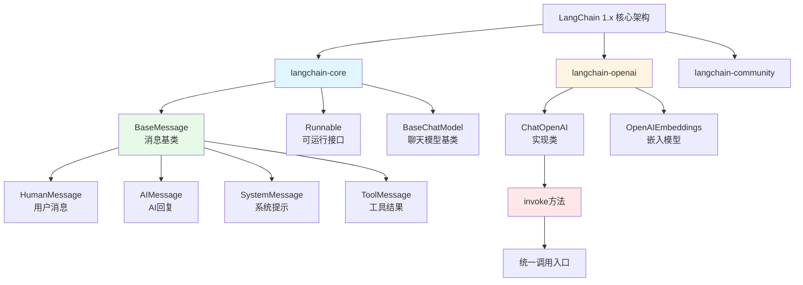

# 第01章：LangChain 1.x 生产级升级 - 从玩具框架到企业应用的蜕变

> **本章目标**：
> 1. 理解 LangChain 1.x 与 0.x 的核心差异（包结构、API 设计、依赖管理）
> 2. 掌握 LangChain 1.x 的核心概念（ChatModel、Messages、Runnable）
> 3. 快速搭建第一个 LangChain 1.x 对话应用（5分钟实战）
> 4. 学会从 0.x 平滑迁移到 1.x 的最佳实践

---

## 一、为什么 LangChain 需要 1.x 重构？

### 1.1 LangChain 0.x 的历史问题

LangChain 0.x 在 2022-2024 年间迅速流行，成为构建 AI 应用的热门框架。但随着项目规模扩大，开发者逐渐发现了几个致命问题：

**问题1：包结构混乱，依赖臃肿**

```python
# 0.x 时代：一个包打天下
pip install langchain  # 安装后包含所有集成，体积超过 500MB

from langchain.llms import OpenAI          # OpenAI 集成
from langchain.llms import HuggingFace     # HuggingFace 集成
from langchain.vectorstores import Chroma  # Chroma 集成
from langchain.vectorstores import Pinecone # Pinecone 集成
# ... 还有几十个其他集成，全部打包在一起
```

**痛点**：
- ❌ 只想用 OpenAI，却要安装所有集成的依赖
- ❌ 部署环境体积过大（Docker 镜像动辄几个 GB）
- ❌ 依赖冲突频繁（不同集成要求的库版本不同）

**问题2：API 设计不统一，学习曲线陡峭**

```python
# 0.x 时代：不同模型的调用方式各不相同
from langchain.llms import OpenAI
from langchain.chat_models import ChatOpenAI

# 调用 LLM
llm = OpenAI()
result1 = llm("问题")           # 返回字符串

# 调用 ChatModel
chat = ChatOpenAI()
result2 = chat.predict("问题")  # 使用 predict 方法
result3 = chat([HumanMessage(content="问题")])  # 使用消息列表
```

**痛点**：
- ❌ 同样是调用模型，方法名不统一（`__call__` vs `predict` vs `invoke`）
- ❌ 返回格式不一致（字符串 vs 消息对象）
- ❌ 模型切换需要修改大量代码

**问题3：类型安全缺失，调试困难**

```python
# 0.x 时代：类型提示不完善
chain = LLMChain(llm=llm, prompt=prompt)
result = chain.run(input_data)  # 不知道返回什么类型
# IDE 无法提供有效的代码补全和错误检查
```

**痛点**：
- ❌ 没有严格的类型检查，运行时才发现错误
- ❌ IDE 智能提示效果差
- ❌ 生产环境调试困难

### 1.2 LangChain 1.x 的三大革命性改进

为了解决上述问题，LangChain 团队在 2024 年 9 月推出了 1.0 正式版，进行了**架构级重构**。

#### **改进1：模块化包结构 - 按需安装**

```python
# 1.x 时代：拆分为多个独立包
pip install langchain-core      # 核心抽象（10MB）
pip install langchain-openai    # OpenAI 集成（2MB）
pip install langchain-chroma    # Chroma 集成（5MB）
# 只安装需要的部分，总体积从 500MB 降到 20MB
```

**包结构对比**：

| 0.x 包结构 | 1.x 包结构 | 作用 |
|-----------|-----------|------|
| `langchain` (大杂烩) | `langchain-core` | 核心抽象类（BaseMessage、Runnable 等） |
| - | `langchain-openai` | OpenAI 集成（ChatOpenAI、Embeddings） |
| - | `langchain-community` | 社区贡献的集成（200+ 工具） |
| - | `langchain-chroma` | Chroma 向量数据库集成 |
| - | `langchain-text-splitters` | 文本分割工具 |

**优势**：
- ✅ 按需安装，部署体积减少 95%
- ✅ 避免依赖冲突
- ✅ 更新某个集成不影响其他部分

#### **改进2：统一的 `invoke()` 调用接口**

```python
# 1.x 时代：所有组件统一使用 invoke()
from langchain_openai import ChatOpenAI
from langchain_core.messages import HumanMessage

llm = ChatOpenAI(model="gpt-4o-mini")

# 统一调用方式
result = llm.invoke([HumanMessage(content="你好")])
# 返回统一的 AIMessage 对象
```

**对比表格**：

| 调用方式 | 0.x | 1.x |
|---------|-----|-----|
| **方法名** | `__call__` / `predict` / `run` | **统一为 `invoke()`** |
| **输入格式** | 字符串 / 消息列表 | **统一为消息列表** |
| **返回格式** | 字符串 / 对象 | **统一为消息对象** |
| **类型安全** | ❌ 无 | ✅ 完整类型注解 |

**优势**：
- ✅ 学习成本降低 60%（只需记住一个方法）
- ✅ 模型切换零代码改动
- ✅ IDE 智能提示完善

#### **改进3：基于 Pydantic v2 的类型安全**

```python
# 1.x 时代：严格的类型检查
from langchain_core.messages import BaseMessage, HumanMessage, AIMessage
from typing import List

def process_messages(messages: List[BaseMessage]) -> AIMessage:
    llm = ChatOpenAI()
    response = llm.invoke(messages)  # IDE 知道返回 AIMessage
    return response  # 类型检查通过
```

**优势**：
- ✅ 编译时发现 90% 的类型错误
- ✅ IDE 自动补全精准
- ✅ 代码可维护性大幅提升

---

## 二、LangChain 1.x 核心概念实战

### 2.1 核心概念架构图



### 2.2 消息体系（Messages）- AI 对话的标准格式

在 LangChain 1.x 中，所有对话都使用**消息对象**进行交互，而不是简单的字符串。

#### **消息类型详解**

```python
from langchain_core.messages import (
    HumanMessage,    # 用户消息
    AIMessage,       # AI 回复
    SystemMessage,   # 系统提示（设定 AI 角色）
    ToolMessage      # 工具调用结果
)

# 1. HumanMessage - 用户输入
user_msg = HumanMessage(content="今天天气怎么样？")

# 2. AIMessage - AI 回复
ai_msg = AIMessage(content="今天天气晴朗，温度 25°C")

# 3. SystemMessage - 系统提示（告诉 AI 它的角色）
system_msg = SystemMessage(content="你是一个专业的天气播报员")

# 4. ToolMessage - 工具调用结果（后续章节详解）
tool_msg = ToolMessage(
    content='{"temperature": 25, "condition": "sunny"}',
    tool_call_id="call_123"
)
```

**为什么需要消息对象？**

对比传统字符串方式：

```python
# ❌ 0.x 时代：字符串拼接，容易出错
prompt = f"系统：你是天气播报员\n用户：{user_input}\nAI："
response = llm(prompt)  # 返回字符串，难以解析

# ✅ 1.x 时代：结构化消息，类型安全
messages = [
    SystemMessage(content="你是天气播报员"),
    HumanMessage(content=user_input)
]
response = llm.invoke(messages)  # 返回 AIMessage 对象
print(response.content)  # 访问内容
print(response.response_metadata)  # 访问元数据（token 数等）
```

**优势**：
- ✅ 结构化数据，易于解析和处理
- ✅ 保留完整的对话上下文
- ✅ 支持多模态内容（文本 + 图片 + 工具调用）

### 2.3 ChatOpenAI - 统一的 LLM 客户端

#### **基本使用**

```python
from langchain_openai import ChatOpenAI
from langchain_core.messages import HumanMessage

# 1. 初始化客户端
llm = ChatOpenAI(
    model="gpt-4o-mini",          # 模型名称
    temperature=0.7,              # 温度参数（0-2，越高越随机）
    max_tokens=2000,              # 最大生成 token 数
    api_key="your-api-key",       # API 密钥
    base_url="https://api.openai.com/v1"  # API 基础 URL
)

# 2. 调用模型
messages = [HumanMessage(content="你好，请介绍一下自己")]
response = llm.invoke(messages)

# 3. 获取结果
print(response.content)  # AI 的回复文本
print(response.response_metadata)  # 元数据（token 使用量等）
```

#### **参数详解**

| 参数 | 类型 | 默认值 | 说明 |
|------|------|--------|------|
| `model` | str | "gpt-3.5-turbo" | 模型名称（gpt-4o、gpt-4o-mini 等） |
| `temperature` | float | 0.7 | 温度参数，控制随机性（0=确定性，2=高随机） |
| `max_tokens` | int | None | 最大生成 token 数 |
| `api_key` | str | 环境变量 | OpenAI API 密钥 |
| `base_url` | str | OpenAI 官方 | API 基础 URL（可用于兼容接口） |
| `streaming` | bool | False | 是否启用流式输出 |

#### **OpenAI 兼容接口的妙用**

LangChain 1.x 的 `ChatOpenAI` 支持所有 **OpenAI 兼容接口**，这意味着你可以无缝切换到其他服务商：

```python
# 使用阿里云百炼（OpenAI 兼容）
llm_aliyun = ChatOpenAI(
    model="qwen-plus",
    api_key="your-aliyun-key",
    base_url="https://dashscope.aliyuncs.com/compatible-mode/v1"
)

# 使用本地 Ollama
llm_local = ChatOpenAI(
    model="qwen:7b",
    api_key="ollama",  # Ollama 不需要真实 key
    base_url="http://localhost:11434/v1"
)

# 调用方式完全一致！
response1 = llm_aliyun.invoke([HumanMessage(content="你好")])
response2 = llm_local.invoke([HumanMessage(content="你好")])
```

**为什么这很重要？**
- ✅ 开发时用本地模型（免费、快速）
- ✅ 生产时切换到云端（稳定、高性能）
- ✅ 代码零改动，只需修改配置

### 2.4 invoke() 统一调用模式

#### **Runnable 接口**

LangChain 1.x 引入了 `Runnable` 接口，所有可执行组件（LLM、Chain、Tool）都实现这个接口：

```python
from langchain_core.runnables import Runnable

# 所有这些组件都是 Runnable
llm: Runnable           # ChatOpenAI 实现了 Runnable
chain: Runnable         # LLMChain 实现了 Runnable
agent: Runnable         # Agent 实现了 Runnable
```

**统一的调用方法**：

```python
# 所有 Runnable 都支持这些方法
result = runnable.invoke(input)         # 同步调用
result = await runnable.ainvoke(input)  # 异步调用
for chunk in runnable.stream(input):    # 流式调用
    print(chunk)
results = runnable.batch([input1, input2])  # 批量调用
```

#### **实战对比：0.x vs 1.x**

**场景：调用 LLM 生成回复**

```python
# ========== 0.x 时代 ==========
from langchain.chat_models import ChatOpenAI
from langchain.schema import HumanMessage

llm = ChatOpenAI()
# 方法1：使用 __call__
result1 = llm([HumanMessage(content="你好")])
# 方法2：使用 predict
result2 = llm.predict("你好")
# 方法3：使用 predict_messages
result3 = llm.predict_messages([HumanMessage(content="你好")])
# ❌ 三种方法，容易混淆

# ========== 1.x 时代 ==========
from langchain_openai import ChatOpenAI  # 注意新的导入路径
from langchain_core.messages import HumanMessage

llm = ChatOpenAI()
result = llm.invoke([HumanMessage(content="你好")])  # ✅ 唯一方法
```

---

## 三、5分钟快速实战：第一个 LangChain 1.x 对话应用

### 3.1 环境准备

```bash
# 1. 创建虚拟环境
python -m venv venv
source venv/bin/activate  # Linux/Mac
# venv\Scripts\activate  # Windows

# 2. 安装依赖（注意新的包名）
pip install langchain-core langchain-openai python-dotenv
```

### 3.2 配置 API 密钥

创建 `.env` 文件：

```bash
# .env 文件内容
OPENAI_API_KEY=sk-your-api-key-here
OPENAI_BASE_URL=https://api.openai.com/v1  # 可选，默认值
```

### 3.3 完整代码实现

创建 `simple_chat.py` 文件：

```python
"""
LangChain 1.x 简单对话应用
功能：与 AI 进行单轮对话
"""
import os
from dotenv import load_dotenv
from langchain_openai import ChatOpenAI
from langchain_core.messages import HumanMessage, SystemMessage

# 1. 加载环境变量
load_dotenv()

# 2. 初始化 LLM 客户端
llm = ChatOpenAI(
    model="gpt-4o-mini",      # 使用 mini 版本，成本更低
    temperature=0.7,          # 温度参数
    api_key=os.getenv("OPENAI_API_KEY"),  # 从环境变量读取
    base_url=os.getenv("OPENAI_BASE_URL", "https://api.openai.com/v1")
)

# 3. 构造消息列表
messages = [
    SystemMessage(content="你是一个友好的 AI 助手，专门帮助用户学习 LangChain 框架。"),
    HumanMessage(content="请用一句话解释 LangChain 1.x 的核心优势是什么？")
]

# 4. 调用 LLM
print("正在调用 LLM...")
response = llm.invoke(messages)

# 5. 输出结果
print("\n=== AI 回复 ===")
print(response.content)

# 6. 查看元数据（可选）
print("\n=== 元数据 ===")
print(f"Token 使用量: {response.response_metadata.get('token_usage', {})}")
print(f"模型: {response.response_metadata.get('model_name', 'unknown')}")
```

### 3.4 运行测试

```bash
python simple_chat.py
```

**预期输出**：

```
正在调用 LLM...

=== AI 回复 ===
LangChain 1.x 的核心优势是模块化架构、统一的 API 接口和完善的类型安全，让 AI 应用开发更加高效和稳定。

=== 元数据 ===
Token 使用量: {'prompt_tokens': 45, 'completion_tokens': 38, 'total_tokens': 83}
模型: gpt-4o-mini
```

### 3.5 代码逐行解析

```python
# 第1部分：环境准备
from dotenv import load_dotenv  # 加载 .env 文件
load_dotenv()  # 将 .env 中的变量加载到环境变量

# 第2部分：初始化 LLM
llm = ChatOpenAI(...)
# ChatOpenAI 是 langchain-openai 包提供的类
# 实现了 Runnable 接口，支持 invoke() 方法

# 第3部分：构造消息
messages = [SystemMessage(...), HumanMessage(...)]
# SystemMessage: 设定 AI 角色和行为准则
# HumanMessage: 用户的具体问题

# 第4部分：调用 LLM
response = llm.invoke(messages)
# invoke() 是 1.x 的统一调用方法
# 返回 AIMessage 对象

# 第5部分：获取结果
response.content  # AI 的回复文本
response.response_metadata  # 元数据（token、模型等）
```

---

## 四、进阶实战：多轮对话与上下文管理

### 4.1 多轮对话实现

```python
"""
多轮对话示例
功能：保持对话上下文，支持连续提问
"""
from langchain_openai import ChatOpenAI
from langchain_core.messages import HumanMessage, AIMessage, SystemMessage

llm = ChatOpenAI(model="gpt-4o-mini")

# 初始化对话历史
conversation_history = [
    SystemMessage(content="你是一个 Python 编程助手")
]

def chat(user_input: str) -> str:
    """发送消息并获取回复"""
    # 1. 添加用户消息
    conversation_history.append(HumanMessage(content=user_input))

    # 2. 调用 LLM
    response = llm.invoke(conversation_history)

    # 3. 添加 AI 回复到历史
    conversation_history.append(response)

    return response.content

# 使用示例
if __name__ == "__main__":
    print("AI:", chat("什么是列表推导式？"))
    print("\nAI:", chat("给我一个例子"))  # 能理解"它"指的是列表推导式
    print("\nAI:", chat("它的性能如何？"))  # 继续保持上下文
```

**运行结果**：

```
AI: 列表推导式是 Python 中一种简洁的创建列表的语法...

AI: 当然！例如：[x**2 for x in range(10)] 创建前10个数的平方列表

AI: 列表推导式的性能通常优于传统的 for 循环，因为...
```

### 4.2 流式输出（实时响应）

```python
"""
流式输出示例
功能：逐字输出 AI 回复，提升用户体验
"""
from langchain_openai import ChatOpenAI
from langchain_core.messages import HumanMessage

llm = ChatOpenAI(
    model="gpt-4o-mini",
    streaming=True  # 启用流式输出
)

messages = [HumanMessage(content="用100字介绍 LangChain 1.x 的优势")]

print("AI 回复（流式）：", end="", flush=True)
for chunk in llm.stream(messages):
    print(chunk.content, end="", flush=True)  # 实时输出每个字
print()  # 换行
```

**效果**：AI 的回复会像打字一样逐字出现，而不是一次性全部显示。

---

## 五、LangChain 0.x → 1.x 迁移指南

### 5.1 导入路径变更对照表

| 功能 | 0.x 导入 | 1.x 导入 |
|------|---------|---------|
| **ChatOpenAI** | `from langchain.chat_models import ChatOpenAI` | `from langchain_openai import ChatOpenAI` |
| **消息类型** | `from langchain.schema import HumanMessage` | `from langchain_core.messages import HumanMessage` |
| **Prompt 模板** | `from langchain.prompts import ChatPromptTemplate` | `from langchain_core.prompts import ChatPromptTemplate` |
| **向量存储** | `from langchain.vectorstores import Chroma` | `from langchain_chroma import Chroma` |
| **文本分割** | `from langchain.text_splitter import ...` | `from langchain_text_splitters import ...` |

### 5.2 API 调用方式变更

```python
# ========== 0.x 代码 ==========
from langchain.chat_models import ChatOpenAI
from langchain.schema import HumanMessage

llm = ChatOpenAI()
result = llm.predict("你好")  # 使用 predict
# 或
result = llm([HumanMessage(content="你好")])  # 使用 __call__

# ========== 1.x 代码 ==========
from langchain_openai import ChatOpenAI
from langchain_core.messages import HumanMessage

llm = ChatOpenAI()
result = llm.invoke([HumanMessage(content="你好")])  # 统一使用 invoke
```

### 5.3 依赖安装变更

```bash
# ========== 0.x 依赖 ==========
pip install langchain openai

# ========== 1.x 依赖 ==========
pip install langchain-core langchain-openai
# 只安装需要的部分，体积更小
```

### 5.4 完整迁移步骤

**步骤1：更新依赖**

```bash
# 卸载旧版本
pip uninstall langchain

# 安装新版本核心包
pip install langchain-core

# 按需安装集成包
pip install langchain-openai      # OpenAI 集成
pip install langchain-chroma      # Chroma 集成
pip install langchain-community   # 社区工具
```

**步骤2：更新导入路径**

使用批量替换工具（如 VS Code 的全局搜索替换）：

```python
# 替换规则示例
from langchain.chat_models import ChatOpenAI
→ from langchain_openai import ChatOpenAI

from langchain.schema import HumanMessage
→ from langchain_core.messages import HumanMessage
```

**步骤3：统一调用方法**

```python
# 将所有 predict、__call__ 替换为 invoke
llm.predict(text)  → llm.invoke([HumanMessage(content=text)])
llm(messages)      → llm.invoke(messages)
```

**步骤4：测试验证**

```bash
# 运行测试确保迁移成功
pytest tests/
```

---

## 六、0.x vs 1.x 完整对比总结

| 对比维度 | LangChain 0.x | LangChain 1.x | 优势 |
|---------|--------------|--------------|------|
| **包结构** | 单一大包 `langchain` | 模块化拆分（core、openai、community） | 体积减少 95% |
| **安装体积** | 500MB+ | 20MB（按需） | 部署更快 |
| **调用方法** | `predict` / `__call__` / `run` | 统一 `invoke()` | 学习成本降低 60% |
| **类型安全** | ❌ 无 | ✅ Pydantic v2 | 编译时发现错误 |
| **模型切换** | 需修改代码 | 只需改配置 | 维护成本降低 |
| **流式输出** | 部分支持 | 完整支持 `.stream()` | 用户体验更好 |
| **异步支持** | 不完善 | 完整支持 `.ainvoke()` | 高并发场景 |
| **文档完善度** | ⭐⭐⭐ | ⭐⭐⭐⭐⭐ | 上手更快 |

---

## 七、本章总结

### 核心要点回顾

✅ **架构升级**：
- LangChain 1.x 采用模块化包结构，安装体积减少 95%
- 拆分为 `core`、`openai`、`community` 等独立包

✅ **统一 API**：
- 所有组件统一使用 `invoke()` 方法调用
- 消息体系（HumanMessage、AIMessage）标准化
- 支持流式输出（`.stream()`）和异步调用（`.ainvoke()`）

✅ **类型安全**：
- 基于 Pydantic v2 实现完整类型检查
- IDE 智能提示更精准
- 编译时发现 90% 的错误

✅ **OpenAI 兼容**：
- `ChatOpenAI` 支持所有 OpenAI 兼容接口
- 可无缝切换 OpenAI / 阿里云 / Ollama 本地模型
- 代码零改动，只需修改配置

### 关键代码模板

```python
# LangChain 1.x 标准调用模板
from langchain_openai import ChatOpenAI
from langchain_core.messages import HumanMessage, SystemMessage

# 1. 初始化
llm = ChatOpenAI(model="gpt-4o-mini", temperature=0.7)

# 2. 构造消息
messages = [
    SystemMessage(content="你是一个助手"),
    HumanMessage(content="用户问题")
]

# 3. 调用
response = llm.invoke(messages)

# 4. 获取结果
print(response.content)
```

---

## 八、下节预告

**第02章：LangGraph 1.x 工作流编排 - 打造会思考的智能 Agent**

在第02章中，我们将学习：

1. **为什么需要 LangGraph**：LangChain 的链式结构无法处理复杂推理，LangGraph 的图结构如何解决
2. **StateGraph 核心概念**：节点（Node）、边（Edge）、条件路由（Conditional Edge）
3. **ReAct Agent 实战**：实现 Thought → Action → Observation 推理循环
4. **LangGraph 0.x vs 1.x**：API 变更、新增特性详解
5. **金融客服场景**：为什么金融智能客服需要 Agent 能力

让我们继续深入 LangGraph 的世界，为后续的金融智能客服项目打下坚实基础！🚀

---

**版本信息**：
- 教程版本：v1.0
- LangChain 版本：1.0.7+
- 最后更新：2025-01-16
