```mermaid
graph LR
    A[用户输入] --> B[步骤1: 检索]
    B --> C[步骤2: 总结]
    C --> D[步骤3: 生æˆå›ç­”]
    D --> E[输出结æœ]

    style A fill:#e1f5ff
    style E fill:#e7f9e7
```

# 第02章：LangGraph 1.x 工作流编排 - 打造会思考的智能 Agent

> **本章目标**：
> 1. 理解 LangGraph 的设计思想（为什么需要 Graph 而不是 Chain）
> 2. 掌握 StateGraph 的构建方法（节点、边、条件路由）
> 3. 实现第一个 ReAct Agent 工作流（Thought → Action → Observation）
> 4. 学会 LangGraph 0.x 到 1.x 的 API 迁移

---

## 一、为什么需要 LangGraph？LangChain 的局限在哪里

### 1.1 LangChain 的链式结构困境

在第01章中，我们学习了 LangChain 1.x 的核心升级。但即使升级到 1.x，LangChain 的**链式结构（Chain）** 仍然存在一个根本性的限制：**无法处理需要循环推理的复杂任务**。

#### **什么是链式结构？**



这是一个典型的 LangChain Chain：**单向、线性、不可回溯**。

#### **链式结构的典型代码**

```python
from langchain_core.prompts import ChatPromptTemplate
from langchain_openai import ChatOpenAI
from langchain_core.output_parsers import StrOutputParser

# 定义链式流程
prompt = ChatPromptTemplate.from_template("总结以下内容：{text}")
llm = ChatOpenAI()
parser = StrOutputParser()

# 组装链（使用 | 运算符）
chain = prompt | llm | parser

# 执行：单向流动，无法回溯
result = chain.invoke({"text": "LangChain 是一个 AI 框架..."})
```

**流程**：输入 → Prompt → LLM → 解析 → 输出（单向流动）

#### **遇到复杂任务时的困境**

**场景：金融客服智能问答**

```
用户："我的信用卡账单什么时候出？最近有什么理财产品适合我？"

理想流程：
1. 思考：这个问题包含两个子问题
2. 行动：先查询信用卡知识库
3. 观察：找到了账单日信息
4. 思考：还需要查询理财产品
5. 行动：查询理财产品知识库
6. 观察：找到了几款产品
7. 思考：需要根据用户画像筛选
8. 行动：调用用户画像工具
9. 观察：获取到用户风险偏好
10. 思考：现在可以综合回答了
11. 最终回答：...
```

**链式结构无法实现**：
- ❌ 无法循环（步骤 2→3→4→5→6... 需要循环多次）
- ❌ 无法根据中间结果动态决策（步骤 7 依赖步骤 6 的结果）
- ❌ 无法回溯（发现信息不够时无法回到步骤 2 重新查询）

### 1.2 LangGraph 的图结构优势

LangGraph 引入了**状态图（State Graph）** 的概念，彻底解决了循环推理问题。

#### **什么是状态图？**



```mermaid
graph TD
    A[用户输入] --> B[Agent 节点<br/>LLM æ¨ç†]
    B --> C{需è¦å·¥å…·?}
    C -->|是| D[Tools 节点<br/>执行工具]
    C -->|å¦| E[输出结æœ]
    D --> B

    style A fill:#e1f5ff
    style B fill:#fff4e1
    style D fill:#ffe7e7
    style E fill:#e7f9e7
```

**核心特点**：
- ✅ **支持循环**：Tools 节点执行后可以回到 Agent 节点
- ✅ **条件分支**：根据 LLM 的输出决定下一步（需要工具 vs 不需要）
- ✅ **状态管理**：每个节点可以读写共享状态（如对话历史）

#### **LangGraph 实现复杂推理**

```python
from langgraph.graph import StateGraph, MessagesState
from langgraph.prebuilt import ToolNode, tools_condition

# 定义状态图
workflow = StateGraph(MessagesState)

# 添加节点
workflow.add_node("agent", agent_node)      # LLM 推理节点
workflow.add_node("tools", ToolNode(tools))  # 工具执行节点

# 添加边（定义流转规则）
workflow.add_edge("__start__", "agent")            # 开始 → agent
workflow.add_conditional_edges(
    "agent",
    tools_condition,  # 条件函数：判断是否需要工具
    # 如果需要工具 → tools 节点
    # 如果不需要 → END
)
workflow.add_edge("tools", "agent")  # tools → agent（循环）

# 编译成可执行应用
app = workflow.compile()
```

**流程**：
1. 用户输入 → Agent（推理）
2. Agent 决定需要工具 → Tools（执行）
3. Tools 返回结果 → Agent（继续推理）← **循环**
4. Agent 决定信息足够 → 输出最终答案

### 1.3 Chain vs Graph 完整对比

| 对比维度 | LangChain (Chain) | LangGraph (Graph) |
|---------|------------------|------------------|
| **结构类型** | 单向链式 | 有向图（支持循环） |
| **执行流程** | A → B → C → 输出 | A → B → C → B → D → 输出 |
| **条件分支** | ❌ 不支持 | ✅ 支持 `tools_condition` |
| **循环推理** | ❌ 不支持 | ✅ 支持回到之前的节点 |
| **状态管理** | 简单变量传递 | 完整的 State 对象 |
| **适用场景** | 简单问答、文本处理 | 复杂 Agent、多步推理 |
| **金融客服** | ❌ 无法处理复杂查询 | ✅ 完美支持 |

**结论**：
- 简单任务（如"总结一段文本"）→ 用 LangChain Chain
- 复杂任务（如"分析财报并给出投资建议"）→ 用 LangGraph

---

## 二、LangGraph 1.x 核心概念详解

### 2.1 核心组件架构图



### 2.2 StateGraph - 状态图构建器

`StateGraph` 是 LangGraph 的核心类，用于构建可执行的工作流图。

#### **基本用法**

```python
from langgraph.graph import StateGraph, MessagesState

# 创建状态图（使用 MessagesState 作为状态类型）
workflow = StateGraph(MessagesState)

# MessagesState 是一个预定义的状态类型，包含：
# - messages: List[BaseMessage]  # 消息列表
# - 自动处理消息追加（通过 add_messages）
```

#### **什么是 State（状态）？**

State 是在工作流中**所有节点共享的数据结构**。就像一个"黑板"，每个节点都可以读取和写入。

```python
from typing import TypedDict, Annotated
from langchain_core.messages import BaseMessage
from langgraph.graph.message import add_messages

# 方式1：使用内置的 MessagesState
from langgraph.graph import MessagesState

# 方式2：自定义 State
class CustomState(TypedDict):
    messages: Annotated[list[BaseMessage], add_messages]  # 消息列表
    user_id: str                                          # 用户ID
    context: dict                                         # 其他上下文
```

**`Annotated[list, add_messages]` 的作用**：
- `add_messages` 是一个特殊函数，告诉 LangGraph 如何合并状态
- 当节点返回新消息时，自动追加到 `messages` 列表（而不是覆盖）

```python
# 示例：add_messages 的工作原理
current_state = {"messages": [msg1, msg2]}
node_return = {"messages": [msg3]}

# 合并后的状态
merged_state = {"messages": [msg1, msg2, msg3]}  # 自动追加
```

### 2.3 节点（Node）- 工作流的执行单元

节点是状态图中的**执行单元**，每个节点是一个函数，接收当前状态，返回新状态。

#### **节点函数签名**

```python
from langgraph.graph import MessagesState

def my_node(state: MessagesState) -> dict:
    """
    参数：state - 当前状态
    返回：字典（用于更新状态）
    """
    # 读取当前状态
    messages = state["messages"]

    # 执行逻辑
    result = do_something(messages)

    # 返回更新（会自动合并到状态中）
    return {"messages": [result]}
```

#### **Agent 节点示例（LLM 推理）**

```python
from langchain_openai import ChatOpenAI
from langgraph.graph import MessagesState

def agent_node(state: MessagesState):
    """Agent 节点：调用 LLM 进行推理"""
    # 1. 初始化 LLM（可以绑定工具）
    llm = ChatOpenAI(model="gpt-4o-mini")
    llm_with_tools = llm.bind_tools([weather_tool, search_tool])

    # 2. 调用 LLM
    messages = state["messages"]
    response = llm_with_tools.invoke(messages)

    # 3. 返回响应（会自动追加到 messages 列表）
    return {"messages": [response]}
```

#### **Tools 节点示例（工具执行）**

```python
from langgraph.prebuilt import ToolNode

# 定义工具列表
tools = [weather_tool, search_tool]

# 创建 Tools 节点（LangGraph 提供的预构建节点）
tool_node = ToolNode(tools)

# ToolNode 会自动：
# 1. 从上一条 AIMessage 中提取 tool_calls
# 2. 执行对应的工具
# 3. 返回 ToolMessage（包含工具执行结果）
```

### 2.4 边（Edge）- 节点之间的连接

边定义了节点之间的**流转规则**。

#### **普通边（固定流转）**

```python
# 添加普通边：A 节点执行后，一定会进入 B 节点
workflow.add_edge("node_a", "node_b")

# 示例：tools 节点执行后，回到 agent 节点
workflow.add_edge("tools", "agent")
```

#### **条件边（动态流转）**

```python
# 添加条件边：根据函数返回值决定下一步
workflow.add_conditional_edges(
    "agent",              # 源节点
    tools_condition,      # 条件函数
    # tools_condition 返回 "tools" → 去 tools 节点
    # tools_condition 返回 "end" → 结束
)
```

**`tools_condition` 条件函数详解**：

```python
from langchain_core.messages import AIMessage

def tools_condition(state: MessagesState):
    """
    判断是否需要调用工具
    返回值：
    - "tools": 需要调用工具
    - "end": 不需要工具，直接结束
    """
    messages = state["messages"]
    last_message = messages[-1]

    # 检查最后一条消息是否包含 tool_calls
    if isinstance(last_message, AIMessage) and last_message.tool_calls:
        return "tools"  # 需要工具
    else:
        return "end"    # 不需要工具
```

LangGraph 1.x 提供了预构建的 `tools_condition`，直接使用即可：

```python
from langgraph.prebuilt import tools_condition

# 直接使用（无需自己实现）
workflow.add_conditional_edges("agent", tools_condition)
```

### 2.5 MemorySaver - 会话持久化

`MemorySaver` 用于在**多轮对话**中保存状态。

```python
from langgraph.checkpoint.memory import MemorySaver

# 创建内存检查点
checkpointer = MemorySaver()

# 编译时传入
app = workflow.compile(checkpointer=checkpointer)

# 调用时指定 thread_id（会话 ID）
config = {"configurable": {"thread_id": "user_123"}}
result = app.invoke({"messages": [HumanMessage(content="你好")]}, config)

# 同一 thread_id 的后续调用会保留历史
result = app.invoke({"messages": [HumanMessage(content="刚才说了什么？")]}, config)
# LLM 能记住之前的对话！
```

**工作原理**：
1. 每次调用后，MemorySaver 将当前状态保存到内存（以 `thread_id` 为 key）
2. 下次调用时，先从内存加载该 `thread_id` 的历史状态
3. 新消息追加到历史消息列表

---

## 三、ReAct Agent 完整实现

### 3.1 什么是 ReAct？

**ReAct = Reasoning（推理）+ Acting（行动）**

这是 Google Research 和 Princeton University 在 2022 年提出的框架，让 LLM 交替进行"思考"和"行动"。

#### **ReAct 工作流程**



#### **ReAct 示例对话**

```
用户："北京今天天气怎么样？明天的户外活动还举办吗？"

Thought 1: 我需要先查询北京今天的天气
Action 1: weather_query("北京")
Observation 1: 北京今天晴，15°C

Thought 2: 我还需要查询明天的天气预报
Action 2: weather_forecast("北京", days=1)
Observation 2: 北京明天多云，温度 12-18°C

Thought 3: 我需要从知识库中查找户外活动的信息
Action 3: document_search("户外活动 举办")
Observation 3: 户外活动将于明天下午 2 点在 XX 地点举行

Thought 4: 我已经获得足够信息，可以给出综合建议了
Final Answer: 北京今天天气晴朗，气温 15°C。明天多云，温度 12-18°C，
天气状况良好，户外活动将正常举办，地点在 XX，时间下午 2 点。建议您
准备一件外套应对温差。
```

### 3.2 完整代码实现

#### **步骤1：定义工具**

```python
from langchain_core.tools import tool

@tool
def get_weather(city: str) -> str:
    """
    获取指定城市的实时天气信息

    参数:
        city: 城市名称，如"北京"、"上海"

    返回:
        天气信息字符串
    """
    # 模拟天气数据（实际应调用天气 API）
    weather_data = {
        "北京": "晴，15°C，空气质量良好",
        "上海": "多云，22°C，湿度 70%",
        "深圳": "雷阵雨，28°C，注意防雨"
    }
    return weather_data.get(city, f"{city}的天气信息暂时无法获取")

@tool
def search_knowledge(query: str) -> str:
    """
    搜索知识库中与查询相关的信息

    参数:
        query: 查询关键词

    返回:
        相关文档片段
    """
    # 模拟知识库检索
    kb = {
        "户外活动": "户外活动将于明天下午2点在奥林匹克公园举行，活动包括徒步、骑行等。",
        "信用卡": "信用卡账单日为每月5号，还款日为每月25号。"
    }
    for key in kb:
        if key in query:
            return kb[key]
    return "未找到相关信息"

# 工具列表
tools = [get_weather, search_knowledge]
```

**技术要点**：
- `@tool` 装饰器：将普通函数转为 LangChain 工具
- `docstring` 非常重要：LLM 靠它决定何时使用工具
- 参数类型注解：LangChain 会自动生成工具 schema

#### **步骤2：定义 Agent 节点**

```python
from langchain_openai import ChatOpenAI
from langgraph.graph import MessagesState

def agent_node(state: MessagesState):
    """Agent 节点：LLM 推理 + 工具绑定"""
    # 1. 初始化 LLM
    llm = ChatOpenAI(model="gpt-4o-mini", temperature=0)

    # 2. 绑定工具（告诉 LLM 有哪些工具可用）
    llm_with_tools = llm.bind_tools(tools)

    # 3. 调用 LLM
    messages = state["messages"]
    response = llm_with_tools.invoke(messages)

    # 4. 返回响应
    return {"messages": [response]}
```

**`bind_tools()` 的作用**：
- 将工具列表转为 OpenAI Function Calling 格式
- LLM 返回时会包含 `tool_calls` 字段（如果需要调用工具）

#### **步骤3：构建工作流图**

```python
from langgraph.graph import StateGraph, MessagesState, START, END
from langgraph.prebuilt import ToolNode, tools_condition
from langgraph.checkpoint.memory import MemorySaver

# 1. 创建状态图
workflow = StateGraph(MessagesState)

# 2. 添加节点
workflow.add_node("agent", agent_node)         # Agent 推理节点
workflow.add_node("tools", ToolNode(tools))    # 工具执行节点

# 3. 添加边
workflow.add_edge(START, "agent")  # 开始 → agent

# 条件边：agent 执行后，判断是否需要工具
workflow.add_conditional_edges(
    "agent",
    tools_condition,  # 预构建的条件函数
    {
        "tools": "tools",  # 如果需要工具 → tools 节点
        END: END           # 如果不需要 → 结束
    }
)

workflow.add_edge("tools", "agent")  # tools → agent（循环）

# 4. 编译（加入会话持久化）
checkpointer = MemorySaver()
app = workflow.compile(checkpointer=checkpointer)
```

**流程说明**：
1. `START → agent`：用户输入进入 Agent 节点
2. `agent → tools_condition`：判断 LLM 是否需要工具
3. 如果需要：`agent → tools → agent`（循环推理）
4. 如果不需要：`agent → END`（输出结果）

#### **步骤4：运行 Agent**

```python
from langchain_core.messages import HumanMessage

# 配置会话 ID
config = {"configurable": {"thread_id": "session_001"}}

# 调用 Agent
user_input = "北京今天天气怎么样？明天的户外活动还举办吗？"
result = app.invoke(
    {"messages": [HumanMessage(content=user_input)]},
    config=config
)

# 获取最终回复
final_answer = result["messages"][-1].content
print(final_answer)
```

**预期输出**：

```
北京今天天气晴朗，气温15°C，空气质量良好。明天的户外活动将正常举办，
时间为明天下午2点，地点在奥林匹克公园，活动包括徒步、骑行等。
建议您准备一件外套应对温差。
```

### 3.3 完整代码汇总

<details>
<summary>点击展开完整代码</summary>

```python
"""
LangGraph 1.x ReAct Agent 完整实现
功能：智能 Agent，支持多轮推理和工具调用
"""
from langchain_openai import ChatOpenAI
from langchain_core.tools import tool
from langchain_core.messages import HumanMessage
from langgraph.graph import StateGraph, MessagesState, START, END
from langgraph.prebuilt import ToolNode, tools_condition
from langgraph.checkpoint.memory import MemorySaver

# ========== 1. 定义工具 ==========
@tool
def get_weather(city: str) -> str:
    """获取指定城市的实时天气信息"""
    weather_data = {
        "北京": "晴，15°C，空气质量良好",
        "上海": "多云，22°C，湿度 70%",
        "深圳": "雷阵雨，28°C，注意防雨"
    }
    return weather_data.get(city, f"{city}的天气信息暂时无法获取")

@tool
def search_knowledge(query: str) -> str:
    """搜索知识库中与查询相关的信息"""
    kb = {
        "户外活动": "户外活动将于明天下午2点在奥林匹克公园举行，活动包括徒步、骑行等。",
        "信用卡": "信用卡账单日为每月5号，还款日为每月25号。"
    }
    for key in kb:
        if key in query:
            return kb[key]
    return "未找到相关信息"

tools = [get_weather, search_knowledge]

# ========== 2. 定义 Agent 节点 ==========
def agent_node(state: MessagesState):
    """Agent 节点：LLM 推理 + 工具绑定"""
    llm = ChatOpenAI(model="gpt-4o-mini", temperature=0)
    llm_with_tools = llm.bind_tools(tools)
    response = llm_with_tools.invoke(state["messages"])
    return {"messages": [response]}

# ========== 3. 构建工作流图 ==========
workflow = StateGraph(MessagesState)

# 添加节点
workflow.add_node("agent", agent_node)
workflow.add_node("tools", ToolNode(tools))

# 添加边
workflow.add_edge(START, "agent")
workflow.add_conditional_edges(
    "agent",
    tools_condition,
    {"tools": "tools", END: END}
)
workflow.add_edge("tools", "agent")

# 编译
checkpointer = MemorySaver()
app = workflow.compile(checkpointer=checkpointer)

# ========== 4. 运行 Agent ==========
if __name__ == "__main__":
    config = {"configurable": {"thread_id": "session_001"}}

    # 测试1：需要多个工具
    user_input = "北京今天天气怎么样？明天的户外活动还举办吗？"
    result = app.invoke(
        {"messages": [HumanMessage(content=user_input)]},
        config=config
    )
    print("=== 测试1 ===")
    print(result["messages"][-1].content)

    # 测试2：简单问题（不需要工具）
    result2 = app.invoke(
        {"messages": [HumanMessage(content="你好")]},
        config=config
    )
    print("\n=== 测试2 ===")
    print(result2["messages"][-1].content)
```

</details>

### 3.4 可视化工作流图（调试利器）

LangGraph 1.x 提供了可视化工具，帮助理解工作流结构：

```python
from IPython.display import Image, display

# 生成工作流图（Mermaid 格式）
display(Image(app.get_graph().draw_mermaid_png()))
```

**输出示例**：


---

## 四、LangGraph 0.x → 1.x API 迁移指南

### 4.1 主要 API 变更

| 功能 | 0.x API | 1.x API | 变更说明 |
|------|---------|---------|---------|
| **创建图** | `Graph()` | `StateGraph(StateType)` | 需要指定状态类型 |
| **添加节点** | `add_node(name, func)` | `add_node(name, func)` | 不变 |
| **起始边** | `set_entry_point(node)` | `add_edge(START, node)` | 使用 START 常量 |
| **结束边** | `set_finish_point(node)` | `add_edge(node, END)` | 使用 END 常量 |
| **条件边** | `add_conditional_edges(...)` | `add_conditional_edges(...)` | 不变 |
| **编译** | `compile()` | `compile(checkpointer=...)` | 支持持久化 |

### 4.2 代码迁移示例

#### **0.x 代码**

```python
from langgraph.graph import Graph

# 创建图
graph = Graph()

# 添加节点
graph.add_node("agent", agent_func)
graph.add_node("tools", tool_func)

# 设置入口和出口
graph.set_entry_point("agent")
graph.set_finish_point("agent")

# 添加条件边
graph.add_conditional_edges("agent", condition_func, {...})
graph.add_edge("tools", "agent")

# 编译
app = graph.compile()
```

#### **1.x 代码**

```python
from langgraph.graph import StateGraph, MessagesState, START, END

# 创建图（需要指定状态类型）
workflow = StateGraph(MessagesState)

# 添加节点
workflow.add_node("agent", agent_func)
workflow.add_node("tools", tool_func)

# 使用 START 和 END 常量
workflow.add_edge(START, "agent")

# 添加条件边
workflow.add_conditional_edges("agent", condition_func, {...})
workflow.add_edge("tools", "agent")

# 编译（支持持久化）
from langgraph.checkpoint.memory import MemorySaver
app = workflow.compile(checkpointer=MemorySaver())
```

### 4.3 新增特性

#### **1. 流式输出**

```python
# 1.x 新增：流式获取每个节点的输出
for chunk in app.stream(
    {"messages": [HumanMessage(content="你好")]},
    config={"configurable": {"thread_id": "123"}},
    stream_mode="messages"  # 流式模式
):
    print(chunk)
```

**`stream_mode` 参数**：
- `"values"`：输出每个节点后的完整状态
- `"updates"`：只输出每个节点的更新部分
- `"messages"`：只输出新增的消息

#### **2. 子图（Subgraph）**

```python
# 1.x 新增：支持嵌套子图
sub_workflow = StateGraph(MessagesState)
# ... 定义子图节点 ...
sub_app = sub_workflow.compile()

# 将子图作为节点添加到主图
main_workflow.add_node("sub_graph", sub_app)
```

---

## 五、为什么金融智能客服需要 LangGraph？

### 5.1 金融客服的典型场景

**场景1：复杂查询**
```
用户："我的信用卡账单什么时候出？最近有什么理财产品适合我？办理需要什么条件？"

需要：
1. 查询信用卡知识库 → 获取账单日
2. 查询理财产品知识库 → 获取产品列表
3. 分析用户画像 → 筛选适合产品
4. 查询产品条件 → 获取办理要求
5. 综合以上信息 → 生成完整回答
```

**Chain 无法实现**：无法循环多次查询
**Graph 完美支持**：agent → tools → agent → tools → ... → 最终回答

**场景2：多步推理**
```
用户："比较一下货币基金和债券基金的风险和收益"

需要：
1. 检索货币基金知识 → 获取风险和收益特征
2. 检索债券基金知识 → 获取风险和收益特征
3. 对比分析 → 生成对比表格
4. 推理总结 → 给出投资建议
```

**Chain 无法实现**：无法根据第1、2步的结果动态调整第3步
**Graph 完美支持**：动态条件分支

### 5.2 LangGraph 在金融场景的优势

| 需求 | Chain 方案 | LangGraph 方案 | 优势 |
|------|----------|---------------|------|
| **多轮查询** | ❌ 需要预先定义固定次数 | ✅ 动态循环，直到信息足够 | 更智能 |
| **条件分支** | ❌ 无法根据中间结果决策 | ✅ `tools_condition` 动态路由 | 更灵活 |
| **回溯重试** | ❌ 无法回到之前的步骤 | ✅ 图结构支持循环边 | 更可靠 |
| **状态管理** | ❌ 简单变量传递 | ✅ 完整的 State 对象 | 更强大 |
| **会话持久化** | ❌ 需要手动实现 | ✅ `MemorySaver` 内置支持 | 更易用 |

---

## 六、本章总结

### 核心要点回顾

✅ **LangGraph 的必要性**：
- LangChain 的 Chain 只能处理单向流程，无法循环推理
- LangGraph 的 Graph 支持循环、条件分支、状态管理
- 金融智能客服等复杂场景必须使用 LangGraph

✅ **核心概念**：
- `StateGraph`：状态图构建器
- `MessagesState`：预定义的消息状态类型
- `Node`：执行单元（Agent 节点、Tools 节点）
- `Edge`：流转规则（普通边、条件边）
- `MemorySaver`：会话持久化

✅ **ReAct 模式**：
- Thought（思考）→ Action（行动）→ Observation（观察）循环
- LLM 自主决定何时使用工具、何时输出最终答案
- 适用于需要多步推理的复杂任务

✅ **1.x vs 0.x**：
- 使用 `START` 和 `END` 常量替代 `set_entry_point`
- 支持流式输出（`stream_mode`）
- 支持子图嵌套
- 内置 `MemorySaver` 会话持久化

### 关键代码模板

```python
# LangGraph 1.x 标准工作流模板
from langgraph.graph import StateGraph, MessagesState, START, END
from langgraph.prebuilt import ToolNode, tools_condition
from langgraph.checkpoint.memory import MemorySaver

# 1. 定义工具
tools = [tool1, tool2, ...]

# 2. 定义 Agent 节点
def agent_node(state):
    llm = ChatOpenAI().bind_tools(tools)
    return {"messages": [llm.invoke(state["messages"])]}

# 3. 构建图
workflow = StateGraph(MessagesState)
workflow.add_node("agent", agent_node)
workflow.add_node("tools", ToolNode(tools))

workflow.add_edge(START, "agent")
workflow.add_conditional_edges("agent", tools_condition)
workflow.add_edge("tools", "agent")

# 4. 编译
app = workflow.compile(checkpointer=MemorySaver())

# 5. 调用
result = app.invoke(
    {"messages": [HumanMessage(content="...")]},
    config={"configurable": {"thread_id": "123"}}
)
```

---

## 七、下节预告

**第03章：金融智能客服项目架构设计 - 从零搭建生产级 RAG 系统**

在第03章中，我们将：

1. **项目技术选型**：为什么选择 LangGraph+RAG（vs 纯 LangChain+RAG）
2. **uv 工程化管理**：使用 uv 创建项目、管理依赖
3. **模块化架构设计**：core、tools、webui 的分层设计思路
4. **环境配置最佳实践**：.env 文件、OpenAI 兼容接口配置
5. **运行第一个版本**：Hello World 版本的金融客服应用

我们将正式进入**金融智能客服系统的实战篇**，把前两章学到的 LangChain 和 LangGraph 知识应用到真实项目中！🚀

---

**版本信息**：
- 教程版本：v1.0
- LangGraph 版本：1.0.3+
- 最后更新：2025-01-16
