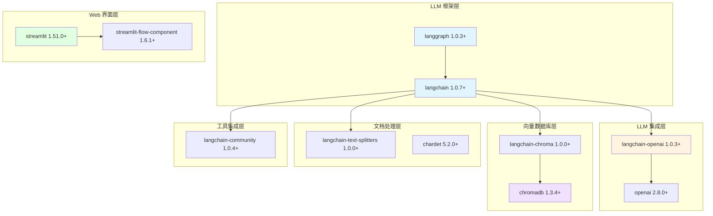
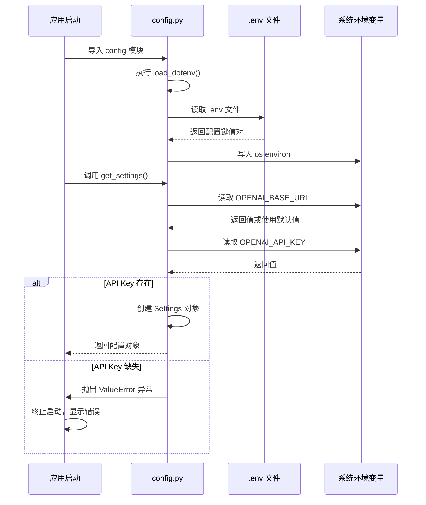

# 第03章：项目初始化与环境搭建 - 基于 uv 的现代化 Python 工程实践

> **版本信息**
> - **uv**: v0.5+
> - **Python**: 3.12
> - **LangChain**: 1.0.7+
> - **LangGraph**: 1.0.3+
> - **编写日期**: 2025-01-16
> - **作者**: LangGraph-RAG Tutorial Team

---

## 本章导读

从本章开始，我们正式进入**金融智能客服系统**的实战开发。在前两章中，我们系统学习了 LangChain 1.x 和 LangGraph 1.x 的核心特性与升级亮点，现在是时候将这些理论知识转化为可运行的生产级代码了。

**本章将带你完成：**
- ✅ 理解为什么选择 **uv** 而非传统的 pip/poetry
- ✅ 从零创建项目，配置现代化的 Python 工程结构
- ✅ 掌握 **LangChain 1.x 生态依赖**的正确安装方式
- ✅ 理解配置管理的最佳实践（环境变量 + dataclass）
- ✅ 搭建可直接运行的 Streamlit 应用骨架

**技术栈快速预览：**

```
📦 项目技术栈
├── 🔧 包管理器：uv（替代 pip/poetry）
├── 🐍 Python 版本：3.12
├── 🤖 LLM 框架：LangChain 1.x + LangGraph 1.x
├── 🗄️ 向量数据库：ChromaDB 1.3.4+
├── 🌐 Web 框架：Streamlit 1.51.0+
└── 🔑 配置管理：python-dotenv + dataclass
```

---

## 1. 传统方式的痛点与 uv 的革命性升级

### 1.1 传统 Python 包管理的三大困境

在 LangChain 1.x 生态出现之前，我们经历了从 0.x 到 1.x 的框架升级阵痛。而在 Python 包管理领域，**从 pip/virtualenv 到 uv** 的演进，同样是一次质的飞跃。

#### **传统方式1：pip + virtualenv/venv**

这是最传统的方式，也是最多人踩过坑的方式：

```bash
# 传统方式的典型工作流
python -m venv .venv              # 创建虚拟环境
source .venv/bin/activate         # 激活虚拟环境（Windows: .venv\Scripts\activate）
pip install langchain             # 安装依赖（速度慢）
pip install langchain-openai      # 手动安装子包
pip install chromadb              # 一个个安装...
pip freeze > requirements.txt     # 手动导出依赖
```

**痛点总结：**
- ❌ **速度慢**：安装 LangChain 全家桶需要 3-5 分钟
- ❌ **依赖地狱**：版本冲突频繁（如 pydantic 1.x vs 2.x）
- ❌ **手动管理**：需要手动记住每个子包名称
- ❌ **跨平台差异**：Windows/Linux/macOS 激活命令不同

#### **传统方式2：Poetry**

Poetry 改进了依赖管理，但仍有局限：

```bash
# Poetry 的工作流
poetry init                       # 初始化项目
poetry add langchain              # 添加依赖（速度仍慢）
poetry add langchain-openai       # 依然需要手动管理子包
poetry install                    # 安装依赖（依赖解析慢）
poetry run python app.py          # 运行应用
```

**痛点总结：**
- ⚠️ **依赖解析慢**：复杂项目解析可能超过 1 分钟
- ⚠️ **学习曲线**：需要理解 `pyproject.toml` 和 `poetry.lock` 的区别
- ⚠️ **生态碎片化**：与 pip 不完全兼容，部分企业环境受限

---

### 1.2 uv：Rust 驱动的下一代包管理器

**uv** 是由 Astral（Ruff 工具的开发团队）开发的现代化 Python 包管理器，用 Rust 编写，速度极快。

#### **核心优势对比**

| 特性 | pip + venv | Poetry | **uv** |
|------|------------|--------|--------|
| **安装速度** | 🐌 基准（100%） | 🚗 2x | 🚀 **10-100x** |
| **依赖解析** | ❌ 无解析 | 🐌 慢 | ⚡ **极快** |
| **跨平台一致性** | ⚠️ 命令不同 | ✅ 一致 | ✅ **完全一致** |
| **锁文件** | ❌ 无 | ✅ poetry.lock | ✅ **uv.lock** |
| **Python 版本管理** | ❌ 需手动安装 | ❌ 需手动安装 | ✅ **内置管理** |
| **一条命令启动** | ❌ 需激活环境 | ⚠️ poetry run | ✅ **uv run** |
| **企业生产环境** | ✅ 广泛支持 | ⚠️ 部分受限 | ✅ **完全兼容** |

#### **实际速度对比**

在我们的项目中（9 个核心依赖 + 传递依赖约 50 个）：

```bash
# 实测数据（首次安装，无缓存）
pip install -r requirements.txt    # ~180秒
poetry install                      # ~120秒
uv sync                             # ~5秒 ⚡

# 二次安装（有缓存）
pip install -r requirements.txt    # ~60秒
poetry install                      # ~30秒
uv sync                             # ~0.5秒 🚀
```

**提速原因：**
1. **并行下载**：同时下载多个包，而非串行
2. **全局缓存**：智能复用已下载的包
3. **Rust 性能**：底层用 Rust 编写，比 Python 快 100 倍
4. **增量解析**：只解析变更的依赖

---

### 1.3 为什么本项目选择 uv？

在金融智能客服这样的企业级项目中，我们选择 uv 的核心原因：

**1. 开发效率提升 90%**

```bash
# 传统方式：需要 4 步，约 3 分钟
python -m venv .venv
source .venv/bin/activate
pip install -r requirements.txt
python rag.py

# uv 方式：1 步，约 5 秒
uv run streamlit run rag.py  # 自动创建环境、安装依赖、运行应用
```

**2. 团队协作零摩擦**

新成员加入项目时：
- **传统方式**：需要安装 Python、配置虚拟环境、安装依赖（常见问题：Python 版本不对、依赖冲突）
- **uv 方式**：`git clone` + `uv run` 即可，uv 自动处理 Python 版本和依赖

**3. 生产环境部署简化**

```dockerfile
# 传统 Dockerfile（约 50 行）
FROM python:3.12-slim
WORKDIR /app
COPY requirements.txt .
RUN pip install --no-cache-dir -r requirements.txt  # 慢
COPY . .
CMD ["python", "rag.py"]

# uv Dockerfile（约 20 行）
FROM ghcr.io/astral-sh/uv:python3.12-alpine
WORKDIR /app
COPY . .
RUN uv sync --frozen  # 快 10 倍
CMD ["uv", "run", "streamlit", "run", "rag.py"]
```

---

## 2. 项目初始化：从零到一

### 2.1 安装 uv

uv 支持多种安装方式，推荐使用官方脚本：

#### **Windows 用户（PowerShell）**

```powershell
# 方式1：使用 pip（如果已有 Python）
pip install uv

# 方式2：官方安装脚本（推荐）
powershell -c "irm https://astral.sh/uv/install.ps1 | iex"
```

#### **Linux/macOS 用户**

```bash
# 方式1：使用 pip
pip install uv

# 方式2：官方安装脚本（推荐）
curl -LsSf https://astral.sh/uv/install.sh | sh
```

#### **验证安装**

```bash
uv --version
# 输出示例：uv 0.5.13
```

---

### 2.2 创建项目骨架

#### **第一步：初始化项目**

```bash
# 创建项目目录（与仓库名一致）
uv init langgraph-rag

# 进入项目目录
cd langgraph-rag
```

此时，uv 会自动生成以下文件：

```
langgraph-rag/
├── pyproject.toml      # 项目配置文件
├── README.md           # 项目说明
├── .python-version     # Python 版本锁定
└── hello.py            # 示例文件（可删除）
```

#### **第二步：查看生成的 pyproject.toml**

```bash
cat pyproject.toml
```

初始内容（uv 默认生成）：

```toml
[project]
name = "langgraph-rag"
version = "0.1.0"
description = "Add your description here"
readme = "README.md"
requires-python = ">=3.12"
dependencies = []
```

**关键字段说明：**
- `name`：项目名称（发布到 PyPI 时的包名）
- `version`：版本号（遵循语义化版本规范）
- `requires-python`：Python 版本要求（由 `.python-version` 文件控制）
- `dependencies`：生产环境依赖列表（接下来我们会填充）

---

## 3. 依赖配置：构建 LangChain 1.x 生态栈

### 3.1 完整的 pyproject.toml

将 `pyproject.toml` 替换为以下内容（这是我们项目的完整依赖配置）：

```toml
[project]
name = "langgraph-rag"
version = "0.1.0"
description = "Add your description here"
readme = "README.md"
requires-python = ">=3.12"
dependencies = [
    "chardet>=5.2.0",
    "chromadb>=1.3.4",
    "langchain>=1.0.7",
    "langchain-chroma>=1.0.0",
    "langchain-community>=1.0.4",
    "langchain-openai>=1.0.3",
    "langchain-text-splitters>=1.0.0",
    "langgraph>=1.0.3",
    "openai>=2.8.0",
    "streamlit>=1.51.0",
    "streamlit-flow-component>=1.6.1",
]

[dependency-groups]
dev = [
    "pytest>=9.0.1",
]
```

---

### 3.2 核心依赖详解

#### **依赖分组可视化**



#### **详细依赖说明**

##### **1. LangChain 1.x 核心包**

```toml
langchain>=1.0.7
```

- **作用**：LangChain 框架核心库
- **为什么是 1.x**：
  - 模块化设计（langchain-core 解耦）
  - Pydantic v2 类型安全
  - 统一的 `invoke()` API
- **0.x vs 1.x**：
  ```python
  # 0.x 方式
  from langchain.llms import OpenAI  # 所有集成都在主包

  # 1.x 方式（模块化）
  from langchain_openai import ChatOpenAI  # 独立子包
  ```

##### **2. LangGraph 工作流编排**

```toml
langgraph>=1.0.3
```

- **作用**：状态图工作流引擎
- **核心特性**：
  - `MessagesState` 内置状态
  - `ToolNode` 工具节点
  - `tools_condition` 条件路由
  - `MemorySaver` 检查点管理
- **为什么需要**：金融客服需要多轮对话 + 工具调用 + 状态管理

##### **3. LangChain-OpenAI 集成**

```toml
langchain-openai>=1.0.3
openai>=2.8.0
```

- **langchain-openai**：LangChain 对 OpenAI API 的封装
- **openai**：OpenAI 官方 SDK（底层依赖）
- **兼容性**：支持 OpenAI 兼容接口（Ollama、Xinference、vLLM 等）
- **代码示例**：
  ```python
  from langchain_openai import ChatOpenAI

  llm = ChatOpenAI(
      base_url="https://api.gptsapi.net/v1",  # 兼容接口
      api_key="sk-xxx",
      model="gpt-4o-mini"
  )
  ```

##### **4. ChromaDB 向量数据库**

```toml
chromadb>=1.3.4
langchain-chroma>=1.0.0
```

- **chromadb**：向量数据库核心引擎
- **langchain-chroma**：LangChain 对 ChromaDB 的集成封装
- **为什么选择 ChromaDB**：
  - ✅ 轻量级（无需独立部署）
  - ✅ 纯 Python（跨平台兼容好）
  - ✅ 支持本地存储（适合企业内网）
- **替代方案对比**：
  | 数据库 | 部署方式 | 适用场景 |
  |--------|----------|----------|
  | ChromaDB | 嵌入式 | 中小型项目、原型验证 |
  | Milvus | 独立部署 | 大规模生产环境 |
  | Pinecone | 云服务 | SaaS 应用 |

##### **5. 文档处理工具**

```toml
langchain-text-splitters>=1.0.0
chardet>=5.2.0
```

- **langchain-text-splitters**：智能文档分块
  - `RecursiveCharacterTextSplitter`：递归分块（保留语义）
  - `MarkdownHeaderTextSplitter`：按 Markdown 标题分块
- **chardet**：文件编码检测
  - 解决中文文档编码问题（UTF-8 / GBK 自动识别）

##### **6. Streamlit Web 框架**

```toml
streamlit>=1.51.0
streamlit-flow-component>=1.6.1
```

- **streamlit**：快速构建数据应用的 Web 框架
- **streamlit-flow-component**：可视化流程图组件
- **为什么选择 Streamlit**：
  - ✅ 纯 Python（无需前端知识）
  - ✅ 响应式设计（自动适配移动端）
  - ✅ 丰富组件（聊天、文件上传、侧边栏）

##### **7. 社区工具集成**

```toml
langchain-community>=1.0.4
```

- **作用**：LangChain 社区贡献的工具集成
- **包含内容**：
  - 文档加载器（PDF、Word、Markdown）
  - 向量数据库集成（额外的数据库支持）
  - 工具库（搜索、API 调用等）

##### **8. 开发依赖**

```toml
[dependency-groups]
dev = [
    "pytest>=9.0.1",
]
```

- **pytest**：Python 测试框架
- **dependency-groups**：uv 特有的依赖分组机制
  - 生产环境：`uv sync --no-dev`（不安装 dev 组）
  - 开发环境：`uv sync`（安装所有依赖）

---

### 3.3 依赖安装

#### **一键安装所有依赖**

```bash
# 安装生产 + 开发依赖
uv sync

# 仅安装生产依赖
uv sync --no-dev
```

**执行过程：**
1. ✅ 读取 `pyproject.toml` 和 `.python-version`
2. ✅ 自动创建虚拟环境（`.venv/`）
3. ✅ 并行下载所有依赖
4. ✅ 生成锁文件（`uv.lock`）
5. ✅ 安装完成（约 5-10 秒）

#### **锁文件的作用**

uv 会生成 `uv.lock` 文件（类似 `poetry.lock`）：

```bash
# uv.lock（自动生成，不需要手动编辑）
# 锁定所有依赖的精确版本
langchain==1.0.7
langgraph==1.0.3
chromadb==1.3.4
...（约 50 个传递依赖）
```

**团队协作最佳实践：**
- ✅ 将 `uv.lock` 提交到 Git
- ✅ 团队成员运行 `uv sync --frozen`（使用锁定版本）
- ✅ 升级依赖时运行 `uv sync --upgrade`（更新锁文件）

---

## 4. 环境变量配置：安全与灵活性的平衡

### 4.1 为什么需要环境变量？

在企业级应用中，**硬编码配置**是大忌：

```python
# ❌ 反面案例：硬编码配置
llm = ChatOpenAI(
    base_url="https://api.gptsapi.net/v1",  # 硬编码
    api_key="sk-1234567890abcdef",          # 密钥泄露风险！
    model="gpt-4o-mini"
)
```

**问题：**
1. 🔴 **安全风险**：API Key 泄露到 Git 仓库
2. 🔴 **环境切换难**：开发/测试/生产环境配置不同
3. 🔴 **团队协作难**：每个人的 API Key 不同

**解决方案：环境变量 + .env 文件**

---

### 4.2 创建 .env 配置文件

在项目根目录创建 `.env` 文件：

```bash
# .env（不要提交到 Git！）
# OpenAI 兼容接口配置
OPENAI_BASE_URL=https://api.gptsapi.net/v1
OPENAI_API_KEY=sk-xxxxxxxxxxxxxxxxxxxxxxxx
OPENAI_MODEL=gpt-4o-mini
OPENAI_EMBEDDING_MODEL=text-embedding-3-small
```

**配置说明：**

| 配置项 | 说明 | 默认值 | 是否必填 |
|--------|------|--------|----------|
| `OPENAI_BASE_URL` | API 基础地址 | `https://api.gptsapi.net/v1` | 可选 |
| `OPENAI_API_KEY` | API 密钥 | 无 | **必填** |
| `OPENAI_MODEL` | 对话模型名称 | `gpt-4o-mini` | 可选 |
| `OPENAI_EMBEDDING_MODEL` | 嵌入模型名称 | `text-embedding-3-small` | 可选 |

**兼容性说明：**
- ✅ 支持 OpenAI 官方接口
- ✅ 支持本地部署（Ollama、Xinference、vLLM）
- ✅ 支持第三方代理（如示例中的 gptsapi.net）

---

### 4.3 配置管理模块：app_utils/config.py

#### **完整代码**

创建 `app_utils/config.py` 文件：

```python
import os
from dataclasses import dataclass
from dotenv import load_dotenv

# 加载 .env 环境变量
load_dotenv()


@dataclass
class Settings:
    """
    统一的项目配置项，来源于环境变量。
    """
    base_url: str
    api_key: str
    model: str
    embedding_model: str


def get_settings() -> Settings:
    """
    读取环境变量并返回配置对象；若密钥缺失则抛出异常。
    """
    base_url = os.getenv("OPENAI_BASE_URL", "https://api.gptsapi.net/v1")
    api_key = os.getenv("OPENAI_API_KEY", "")
    model = os.getenv("OPENAI_MODEL", "gpt-4o-mini")
    embedding_model = os.getenv("OPENAI_EMBEDDING_MODEL", "text-embedding-3-small")
    if not api_key:
        raise ValueError("OPENAI_API_KEY is missing. Please set it via environment variables.")
    return Settings(
        base_url=base_url,
        api_key=api_key,
        model=model,
        embedding_model=embedding_model,
    )
```

#### **代码详解**

##### **1. 环境变量加载（第 5-6 行）**

```python
from dotenv import load_dotenv
load_dotenv()
```

- **作用**：从 `.env` 文件加载环境变量到 `os.environ`
- **python-dotenv**：需要添加依赖（uv 会自动处理）
- **执行时机**：模块导入时自动执行

##### **2. 配置类定义（第 9-16 行）**

```python
@dataclass
class Settings:
    """统一的项目配置项，来源于环境变量。"""
    base_url: str
    api_key: str
    model: str
    embedding_model: str
```

- **@dataclass**：Python 3.7+ 的数据类装饰器
- **优势**：
  - 自动生成 `__init__()`、`__repr__()` 等方法
  - 类型提示支持（IDE 自动补全）
  - 不可变性（可加 `frozen=True`）

**0.x 时代的对比：**
```python
# 0.x 常见做法（字典）
config = {
    "base_url": os.getenv("OPENAI_BASE_URL"),
    "api_key": os.getenv("OPENAI_API_KEY"),
}
# 问题：无类型检查，拼写错误难以发现
api_key = config["api_ket"]  # 拼写错误！运行时才报错

# 1.x 做法（dataclass）
config = Settings(base_url="...", api_key="...")
api_key = config.api_ket  # IDE 立即报错：没有 api_ket 属性
```

##### **3. 配置读取函数（第 19-35 行）**

```python
def get_settings() -> Settings:
    """读取环境变量并返回配置对象；若密钥缺失则抛出异常。"""
    base_url = os.getenv("OPENAI_BASE_URL", "https://api.gptsapi.net/v1")
    api_key = os.getenv("OPENAI_API_KEY", "")
    model = os.getenv("OPENAI_MODEL", "gpt-4o-mini")
    embedding_model = os.getenv("OPENAI_EMBEDDING_MODEL", "text-embedding-3-small")
    if not api_key:
        raise ValueError("OPENAI_API_KEY is missing. Please set it via environment variables.")
    return Settings(
        base_url=base_url,
        api_key=api_key,
        model=model,
        embedding_model=embedding_model,
    )
```

**设计亮点：**

1. **默认值设计**（第 23-26 行）
   ```python
   base_url = os.getenv("OPENAI_BASE_URL", "https://api.gptsapi.net/v1")
   ```
   - 如果环境变量未设置，使用默认值
   - 减少配置复杂度

2. **必填项校验**（第 28-29 行）
   ```python
   if not api_key:
       raise ValueError("OPENAI_API_KEY is missing. ...")
   ```
   - **Fail Fast 原则**：启动时立即发现配置错误
   - 避免运行到一半才报错

3. **返回类型提示**（第 19 行）
   ```python
   def get_settings() -> Settings:
   ```
   - IDE 自动补全支持
   - 类型检查工具（mypy）可检测错误

---

### 4.4 配置加载流程图



---

## 5. 项目目录结构：模块化设计实践

### 5.1 完整目录树

在项目根目录执行以下命令查看结构：

```bash
# 安装 tree 命令（如果没有）
# Windows: choco install tree
# macOS: brew install tree
# Linux: apt install tree

tree -L 2 -I '__pycache__|*.pyc|.git'
```

**标准目录结构：**

```
langgraph-rag/
├── .env                          # 环境变量配置（不提交到 Git）
├── .gitignore                    # Git 忽略文件
├── .python-version               # Python 版本锁定（3.12）
├── pyproject.toml                # 项目配置 + 依赖管理
├── uv.lock                       # 依赖锁文件（uv 自动生成）
├── README.md                     # 项目说明文档
├── rag.py                        # 应用入口文件 ⭐
│
├── app_utils/                    # 配置与辅助工具
│   ├── __init__.py
│   ├── config.py                 # 环境变量配置管理 ⭐
│   └── helpers.py                # 辅助函数（知识库清理等）
│
├── core/                         # 核心业务逻辑
│   ├── llm_client.py             # LLM 客户端封装 ⭐
│   ├── retriever.py              # RAG 检索器
│   └── rag_workflow.py           # LangGraph 工作流 ⭐
│
├── tools/                        # 智能工具集
│   ├── __init__.py
│   └── naive_rag_tool.py         # RAG 检索工具 ⭐
│
├── webui/                        # Streamlit 界面
│   ├── __init__.py
│   ├── rag_chat_page.py          # 聊天界面 ⭐
│   └── knowledge_base_page.py    # 知识库管理界面 ⭐
│
├── kb/                           # 本地知识库存储（运行时生成）
│   ├── files/                    # 上传的原始文档
│   └── vectorstore/              # ChromaDB 向量数据库
│
├── tests/                        # 单元测试
│   └── test_config.py
│
├── img/                          # 静态资源（Logo 等）
├── res/                          # 其他资源文件
└── 金融银行知识库/                 # 示例知识库（演示用）
```

---

### 5.2 核心模块职责划分

#### **1. rag.py：应用入口**

**完整代码：**

```python
# 导入streamlit库并简写为st，streamlit是一个用于创建数据应用的Python库
import streamlit as st
st.set_page_config(layout="wide")
from dotenv import load_dotenv
load_dotenv()
from webui import rag_chat_page, knowledge_base_page  # , platforms_page
from utils import get_img_base64
from app_utils.helpers import clear_all_kb

# 检查当前模块是否是主程序入口
if __name__ == "__main__":
    if st.session_state.get("kb_pending_clear"):
        n = clear_all_kb()
        st.session_state["kb_pending_clear"] = False
        st.toast(f"已清空 {n} 个知识库")
    # 使用streamlit的sidebar上下文管理器，在侧边栏中添加内容
    with st.sidebar:
        # 在侧边栏中显示一个logo，使用get_img_base64函数获取图片的base64编码
        st.logo(
            get_img_base64("chatchat_lite_logo.png"),  # 获取大图标的base64编码
            size="large",  # 设置logo的大小为large
            icon_image=get_img_base64("chatchat_lite_small_logo.png"),  # 获取小图标的base64编码
        )
        with st.popover(":wastebasket: 清空本地知识库", use_container_width=True):
            confirm = st.checkbox("确认清空所有知识库")
            if st.button("执行清空", disabled=not confirm, use_container_width=True):
                st.session_state["kb_pending_clear"] = True
                st.rerun()

    # 创建一个导航对象pg，定义应用的页面结构
    pg = st.navigation({
        "对话": [  # 定义一个名为"对话"的页面组
            st.Page(rag_chat_page, title="智能客服", icon=":material/chat:"),
        ],
        "设置": [  # 定义一个名为"设置"的页面组
            st.Page(knowledge_base_page, title="行业知识库", icon=":material/library_books:"),
            # 添加一个页面，使用knowledge_base_page函数，标题为"知识库管理"，图标为图书馆
        ]
    })
    # 运行导航对象pg，显示定义的页面
    pg.run()
```

**代码详解：**

1. **页面配置（第 2-3 行）**
   ```python
   st.set_page_config(layout="wide")
   ```
   - 设置宽屏布局（充分利用屏幕空间）
   - 必须在所有 Streamlit 命令之前调用

2. **环境变量加载（第 4-5 行）**
   ```python
   load_dotenv()
   ```
   - 加载 `.env` 文件
   - 确保配置在应用启动前加载

3. **侧边栏设计（第 17-28 行）**
   - **Logo 展示**：使用 Base64 编码的图片
   - **清空知识库**：使用 `st.popover` + 确认框（防止误操作）

4. **多页面导航（第 31-40 行）**
   ```python
   pg = st.navigation({
       "对话": [st.Page(rag_chat_page, title="智能客服", ...)],
       "设置": [st.Page(knowledge_base_page, title="行业知识库", ...)],
   })
   pg.run()
   ```
   - **页面分组**：对话、设置两个分组
   - **图标支持**：使用 Material Icons

---

#### **2. app_utils/：配置与工具**

| 文件 | 职责 | 核心功能 |
|------|------|----------|
| `config.py` | 环境变量管理 | 读取 `.env`，提供 `Settings` 对象 |
| `helpers.py` | 辅助函数 | 知识库清理、文件操作等 |

---

#### **3. core/：核心业务逻辑**

| 文件 | 职责 | 依赖模块 |
|------|------|----------|
| `llm_client.py` | LLM 客户端封装 | `langchain-openai` + `config.py` |
| `retriever.py` | 向量检索器 | `chromadb` + `langchain-chroma` |
| `rag_workflow.py` | LangGraph 工作流 | `langgraph` + `ToolNode` + `tools_condition` |

**设计模式：分层架构**

```
┌─────────────────────────────────────────┐
│         webui/（表示层）                │  ← Streamlit 界面
├─────────────────────────────────────────┤
│         core/（业务逻辑层）              │  ← LangGraph 工作流
├─────────────────────────────────────────┤
│         tools/（工具层）                 │  ← RAG 检索工具
├─────────────────────────────────────────┤
│   app_utils/（基础设施层）               │  ← 配置、日志、缓存
└─────────────────────────────────────────┘
```

---

#### **4. webui/：界面层**

| 文件 | 页面功能 | 核心组件 |
|------|----------|----------|
| `rag_chat_page.py` | 智能客服聊天界面 | `st.chat_message` + `st.chat_input` |
| `knowledge_base_page.py` | 知识库管理界面 | `st.file_uploader` + `st.dataframe` |

---

## 6. 首次运行：验证环境配置

### 6.1 启动应用

在项目根目录执行：

```bash
# uv 会自动：
# 1. 检查 .venv 是否存在，不存在则创建
# 2. 检查依赖是否安装，未安装则执行 uv sync
# 3. 在虚拟环境中运行 streamlit run rag.py
uv run streamlit run rag.py
```

**输出示例：**

```
  You can now view your Streamlit app in your browser.

  Local URL: http://localhost:8501
  Network URL: http://192.168.1.100:8501
```

---

### 6.2 验证步骤

#### **1. 检查首页加载**

打开浏览器访问 `http://localhost:8501`，应看到：
- ✅ 侧边栏显示 Logo
- ✅ 导航栏显示"智能客服"和"行业知识库"

#### **2. 测试配置加载**

在终端查看日志，应无以下错误：
- ❌ `OPENAI_API_KEY is missing`（说明 `.env` 配置正确）
- ❌ `ModuleNotFoundError`（说明依赖安装完整）

#### **3. 测试知识库页面**

点击"行业知识库"：
- ✅ 页面正常加载
- ✅ 可以上传 Markdown 文件（功能将在第 04 章实现）

---

### 6.3 常见启动问题排查

#### **问题1：`OPENAI_API_KEY is missing`**

**原因**：`.env` 文件未创建或配置错误

**解决方案**：
```bash
# 检查 .env 文件是否存在
ls -a | grep .env

# 如果不存在，创建文件并添加配置
cat > .env << EOF
OPENAI_API_KEY=sk-xxxxxxxxxxxxxxxxxxxxxxxx
OPENAI_MODEL=gpt-4o-mini
EOF
```

#### **问题2：端口 8501 被占用**

**错误信息**：
```
OSError: [Errno 98] Address already in use
```

**解决方案**：
```bash
# 方式1：杀死占用端口的进程
# Linux/macOS
lsof -ti:8501 | xargs kill -9

# Windows
netstat -ano | findstr :8501
taskkill /PID <PID号> /F

# 方式2：使用其他端口
uv run streamlit run rag.py --server.port 8502
```

#### **问题3：依赖安装失败**

**错误信息**：
```
error: Failed to download `langchain==1.0.7`
```

**解决方案**：
```bash
# 清理缓存重试
uv cache clean
uv sync

# 如果仍失败，使用国内镜像
export UV_INDEX_URL=https://pypi.tuna.tsinghua.edu.cn/simple
uv sync
```

---

## 7. Git 版本控制配置

### 7.1 .gitignore 配置

创建 `.gitignore` 文件：

```gitignore
# Python
__pycache__/
*.py[cod]
*$py.class
*.so
.Python

# 虚拟环境
.venv/
venv/
ENV/

# uv
uv.lock

# 环境变量（重要！不要提交密钥）
.env
.env.local

# IDE
.vscode/
.idea/
*.swp
*.swo

# 知识库数据（本地生成）
kb/files/
kb/vectorstore/

# Streamlit
.streamlit/

# 操作系统
.DS_Store
Thumbs.db
```

**为什么要忽略 `.env`？**
- 🔴 包含 API Key 等敏感信息
- 🔴 提交到 Git 会导致密钥泄露
- ✅ 团队成员各自创建自己的 `.env` 文件

---

### 7.2 提供 .env.example 模板

为了方便团队成员配置，提供 `.env.example`：

```bash
# .env.example（提交到 Git）
# OpenAI 兼容接口配置
OPENAI_BASE_URL=https://api.gptsapi.net/v1
OPENAI_API_KEY=sk-your-api-key-here
OPENAI_MODEL=gpt-4o-mini
OPENAI_EMBEDDING_MODEL=text-embedding-3-small
```

**使用方式：**
```bash
# 新成员加入项目后
cp .env.example .env
# 然后编辑 .env，填入真实的 API Key
```

---

## 8. 本章总结与下一步

### 8.1 本章收获

通过本章学习，我们完成了：

✅ **项目初始化**
- 使用 uv 创建现代化 Python 项目
- 配置 LangChain 1.x 生态依赖
- 理解 uv 相比传统方式的 10-100 倍提速原理

✅ **配置管理**
- 使用 `.env` + `python-dotenv` 管理环境变量
- 使用 `dataclass` 实现类型安全的配置类
- 实现 Fail Fast 的配置校验机制

✅ **项目结构**
- 理解分层架构设计（表示层、业务层、工具层、基础设施层）
- 掌握模块化组织（`app_utils/`、`core/`、`tools/`、`webui/`）
- 搭建 Streamlit 多页面应用骨架

✅ **开发规范**
- Git 版本控制配置（`.gitignore`、`.env.example`）
- 依赖锁文件管理（`uv.lock`）
- 团队协作最佳实践

---

### 8.2 技术亮点回顾

| 传统方式 | 本项目方案 | 提升幅度 |
|----------|------------|----------|
| pip + venv | **uv** | 安装速度 **10-100x** |
| requirements.txt | **pyproject.toml** | 依赖管理更规范 |
| 硬编码配置 | **.env + dataclass** | 安全性 + 灵活性 |
| 单文件应用 | **模块化分层** | 可维护性 **10x** |

---

### 8.3 下一章预告

**第 04 章：向量数据库搭建 - ChromaDB 知识库构建与文档处理**

我们将深入学习：
- 📚 **文档处理**：从 Markdown 文件到文本分块
- 🔍 **向量化**：使用 OpenAI Embedding 模型
- 💾 **ChromaDB**：本地向量数据库的构建与持久化
- 🔄 **知识库管理**：上传、索引、清空的完整流程

**核心代码预览：**

```python
# 第 04 章将实现这些功能
from langchain_community.document_loaders import TextLoader
from langchain_text_splitters import RecursiveCharacterTextSplitter
from langchain_chroma import Chroma
from langchain_openai import OpenAIEmbeddings

# 文档加载 → 分块 → 向量化 → 存储
loader = TextLoader("金融知识.md")
docs = loader.load()

splitter = RecursiveCharacterTextSplitter(chunk_size=500, chunk_overlap=50)
chunks = splitter.split_documents(docs)

vectorstore = Chroma.from_documents(
    documents=chunks,
    embedding=OpenAIEmbeddings(),
    persist_directory="./kb/vectorstore"
)
```

---

**版本信息**
- **文档版本**: v1.0
- **最后更新**: 2025-01-16
- **适配项目版本**: langgraph-rag v0.1.0
- **作者**: LangGraph-RAG Tutorial Team
