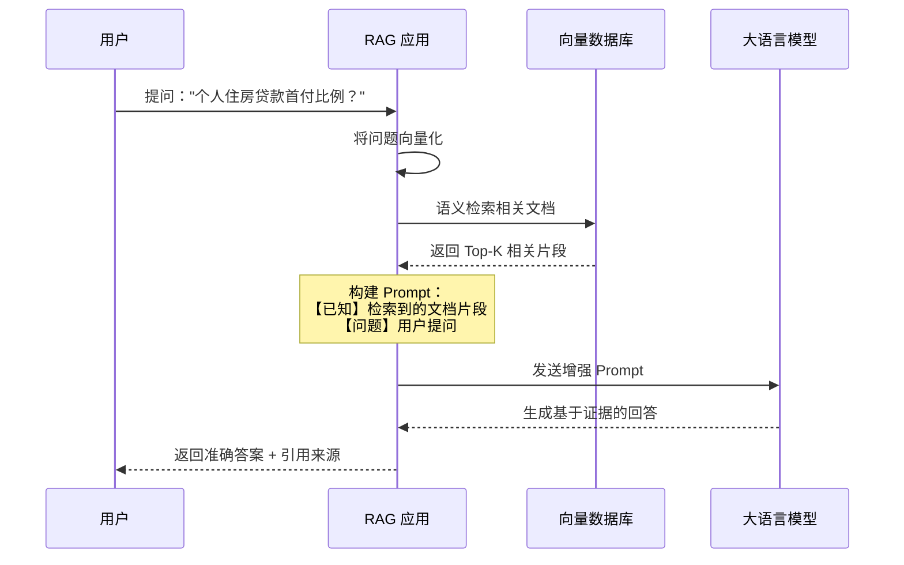
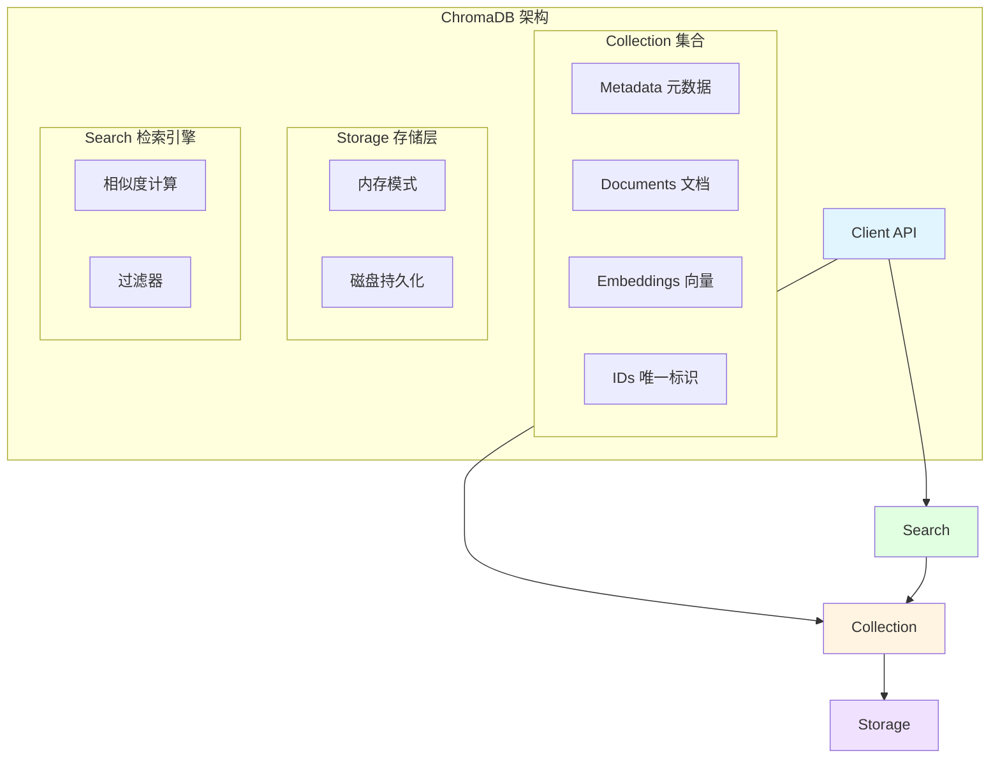
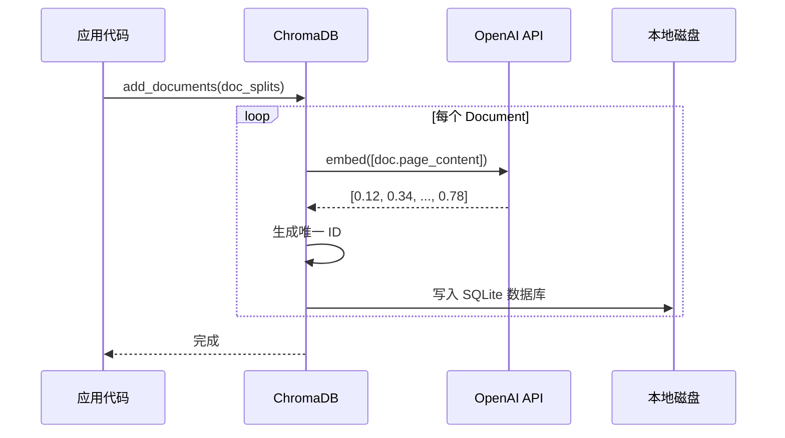

# 第04章：向量数据库搭建 - ChromaDB 知识库构建与文档处理

> **版本信息**
> - **ChromaDB**: 1.3.4+
> - **LangChain**: 1.0.7+
> - **langchain-chroma**: 1.0.0+
> - **langchain-text-splitters**: 1.0.0+
> - **编写日期**: 2025-01-16
> - **作者**: LangGraph-RAG Tutorial Team

---

## 本章导读

在上一章中，我们完成了项目的基础环境搭建。现在，是时候构建 RAG 系统的核心基础设施——**向量数据库**了。

**本章核心问题：**
- 💭 为什么需要向量数据库？传统数据库为何不够用？
- 🔍 如何将 Markdown 文档转化为可检索的向量？
- 📚 如何优雅地分块文档而不破坏语义？
- 💾 ChromaDB 如何持久化存储并实现高效检索？
- 🛠️ 如何构建知识库的完整生命周期（创建→上传→检索→清空）？

**本章将带你实现：**
- ✅ 理解 RAG 的核心原理（Retrieval-Augmented Generation）
- ✅ 掌握 ChromaDB 的架构与 LangChain 1.x 集成
- ✅ 实现智能文档加载（自动编码检测）
- ✅ 掌握文本分块的最佳实践（chunk_size、chunk_overlap）
- ✅ 构建完整的知识库管理系统（Streamlit 界面 + 后端逻辑）

**技术栈快速预览：**

```
📦 本章技术栈
├── 🗄️ 向量数据库：ChromaDB 1.3.4+
├── 🔗 LangChain 集成：langchain-chroma 1.0.0+
├── 📄 文档加载：DirectoryLoader + TextLoader
├── ✂️ 文本分块：RecursiveCharacterTextSplitter + MarkdownTextSplitter
├── 🧮 向量化：OpenAIEmbeddings (text-embedding-3-small)
└── 🌐 界面：Streamlit (知识库管理页面)
```

---

## 1. RAG 原理与向量数据库的必要性

### 1.1 传统 LLM 的三大困境

在引入 RAG 之前，纯 LLM 应用面临以下问题：

#### **困境1：知识截止日期（Knowledge Cutoff）**

```python
# 假设使用 GPT-4（知识截止 2023-04）
from langchain_openai import ChatOpenAI

llm = ChatOpenAI(model="gpt-4o-mini")
response = llm.invoke("我们公司2024年最新的贷款产品有哪些？")

# 输出：抱歉，我的知识库截止到2023年4月，无法回答2024年的最新产品。
```

**问题**：
- ❌ 无法获取训练数据之后的信息
- ❌ 企业内部知识（如产品手册、政策文档）未在训练数据中

---

#### **困境2：幻觉问题（Hallucination）**

```python
response = llm.invoke("贵行的个人住房贷款最低首付比例是多少？")

# 可能输出：根据国家政策，首付比例通常为30%。
# 实际情况：该银行政策可能是20%或其他比例，LLM"编造"了答案
```

**问题**：
- ❌ 没有明确依据时，LLM 会基于概率生成"看起来合理"的答案
- ❌ 金融、医疗等领域对准确性要求极高，幻觉不可接受

---

#### **困境3：上下文长度限制**

```python
# 假设要回答复杂问题，需要参考100页的产品手册
long_document = open("产品手册.txt").read()  # 50,000 tokens

# GPT-4o-mini 上下文窗口：128k tokens
# 但实际上：
# 1. 成本高（输入 token 越多，费用越高）
# 2. 性能差（长上下文会导致"中间信息遗忘"）
# 3. 不可维护（每次都要传递完整文档）
```

---

### 1.2 RAG 的革命性解决方案

**RAG（Retrieval-Augmented Generation）** = 检索增强生成

核心思想：**不是让 LLM 记住所有知识，而是教会它"查阅资料"**。

#### **工作流程：**



**关键步骤详解：**

1. **文档预处理**（离线）
   ```python
   # 第1步：加载文档
   docs = load_documents("产品手册.md")

   # 第2步：分块（避免单个片段过长）
   chunks = split_into_chunks(docs, chunk_size=500)

   # 第3步：向量化
   embeddings = [embed(chunk) for chunk in chunks]

   # 第4步：存储到向量数据库
   vectordb.add(chunks, embeddings)
   ```

2. **在线查询**（实时）
   ```python
   # 第1步：用户提问
   query = "个人住房贷款首付比例？"

   # 第2步：检索相关文档
   relevant_docs = vectordb.search(query, top_k=3)

   # 第3步：构建 Prompt
   prompt = f"""
   【已知信息】
   {relevant_docs}

   【问题】
   {query}

   【要求】
   请基于【已知信息】回答问题，如果信息不足，请明确说明。
   """

   # 第4步：LLM 生成答案
   answer = llm.invoke(prompt)
   ```

---

### 1.3 为什么选择向量数据库？

#### **传统关键词检索 vs 向量语义检索**

| 检索方式 | 原理 | 示例 | 缺点 |
|----------|------|------|------|
| **关键词检索**<br/>（传统数据库） | 精确匹配文本 | 搜索"贷款利率"<br/>→ 只返回包含"贷款利率"的文档 | ❌ 无法理解同义词<br/>❌ 无法理解语义 |
| **向量语义检索**<br/>（向量数据库） | 基于语义相似度 | 搜索"贷款利率"<br/>→ 返回"房贷利率"、"借款成本"等 | ✅ 理解语义<br/>✅ 支持模糊查询 |

**实际案例：**

```python
# 用户问题："我想知道房子按揭的费用"
#
# 传统检索（关键词匹配）：
# - 搜索 "房子" + "按揭" + "费用"
# - 找不到匹配（因为文档中用的是"住房贷款利率"）
# 结果：❌ 无结果

# 向量检索（语义匹配）：
# - 将问题向量化：[0.12, 0.34, 0.56, ..., 0.78]
# - 在向量空间中找最近邻
# - 找到语义相似的文档："个人住房贷款利率政策"
# 结果：✅ 精准匹配
```

---

### 1.4 为什么选择 ChromaDB？

市面上主流向量数据库对比：

| 数据库 | 类型 | 部署方式 | 适用场景 | 本项目选择理由 |
|--------|------|----------|----------|----------------|
| **ChromaDB** | 嵌入式 | 单文件/进程内 | 中小型项目、原型开发 | ✅ **零运维**<br/>✅ **纯Python**<br/>✅ **企业内网友好** |
| Pinecone | 云服务 | SaaS | 云原生应用 | ❌ 需外网<br/>❌ 按查询收费 |
| Milvus | 独立部署 | Docker/K8s | 大规模生产环境 | ❌ 部署复杂<br/>❌ 资源消耗高 |
| Weaviate | 独立部署 | Docker | 中大型项目 | ❌ 需额外服务 |
| Qdrant | 独立部署 | Docker/Rust | 性能敏感场景 | ❌ 学习成本高 |

**ChromaDB 的核心优势：**

1. **零运维部署**
   ```python
   # 无需启动服务，直接使用
   from langchain_chroma import Chroma

   vectorstore = Chroma(
       persist_directory="./kb/vectorstore"  # 本地目录即可
   )
   ```

2. **纯 Python 生态**
   - 兼容性好（Windows/Linux/macOS）
   - 安装简单（`pip install chromadb`）
   - 无需学习新的查询语言

3. **企业内网适配**
   - 无需外网连接
   - 数据完全本地存储
   - 符合金融行业安全要求

---

## 2. ChromaDB 架构与 LangChain 1.x 集成

### 2.1 ChromaDB 核心概念

#### **架构图：**



**核心概念解释：**

1. **Collection（集合）**
   - 类似传统数据库的"表"
   - 一个知识库对应一个 Collection
   - 每个 Collection 有独立的向量空间

2. **Document（文档）**
   - 实际存储的文本内容
   - 例如：`"个人住房贷款首付比例为20%..."`

3. **Embedding（向量）**
   - Document 的向量表示
   - 例如：`[0.12, 0.34, 0.56, ..., 0.78]`（1536维）

4. **Metadata（元数据）**
   - 文档的附加信息
   - 例如：`{"source": "产品手册.md", "page": 3}`

5. **ID（唯一标识）**
   - 每个文档的唯一ID
   - ChromaDB 自动生成或手动指定

---

### 2.2 LangChain 1.x 的集成封装

在 LangChain 0.x 时代，使用 ChromaDB 需要大量手动代码：

#### **0.x 时代的痛苦（约 80 行代码）**

```python
# 0.x 方式（需要手动管理一切）
import chromadb
from chromadb.config import Settings
from langchain.embeddings import OpenAIEmbeddings

# 第1步：手动创建客户端
client = chromadb.Client(Settings(
    chroma_db_impl="duckdb+parquet",
    persist_directory="./kb/vectorstore"
))

# 第2步：手动创建/获取 Collection
collection = client.get_or_create_collection(
    name="my_knowledge_base",
    metadata={"description": "金融知识库"}
)

# 第3步：手动向量化
embeddings = OpenAIEmbeddings()
texts = ["文档1", "文档2", "文档3"]
vectors = embeddings.embed_documents(texts)

# 第4步：手动插入数据
collection.add(
    documents=texts,
    embeddings=vectors,
    ids=[f"doc_{i}" for i in range(len(texts))],
    metadatas=[{"source": f"file_{i}.md"} for i in range(len(texts))]
)

# 第5步：手动查询
query_vector = embeddings.embed_query("查询问题")
results = collection.query(
    query_embeddings=[query_vector],
    n_results=3
)

# 第6步：手动解析结果
docs = results["documents"][0]
distances = results["distances"][0]
```

**问题：**
- ❌ 代码冗长（80+ 行才能完成基本操作）
- ❌ 需要理解 ChromaDB 的底层 API
- ❌ 手动管理向量化、ID 生成、元数据
- ❌ 不支持 LangChain 的 Retriever 接口

---

#### **1.x 时代的优雅（约 10 行代码）**

```python
# 1.x 方式（langchain-chroma 集成）
from langchain_chroma import Chroma
from langchain_openai import OpenAIEmbeddings
from langchain_community.document_loaders import TextLoader
from langchain_text_splitters import RecursiveCharacterTextSplitter

# 第1步：加载文档
loader = TextLoader("产品手册.md")
documents = loader.load()

# 第2步：分块
text_splitter = RecursiveCharacterTextSplitter(chunk_size=500, chunk_overlap=50)
chunks = text_splitter.split_documents(documents)

# 第3步：一键创建向量库（自动向量化、自动存储）
vectorstore = Chroma.from_documents(
    documents=chunks,
    embedding=OpenAIEmbeddings(),
    persist_directory="./kb/vectorstore"
)

# 第4步：直接使用检索器
retriever = vectorstore.as_retriever(search_kwargs={"k": 3})
results = retriever.invoke("查询问题")
```

**优势：**
- ✅ 代码减少 **88%**（80行 → 10行）
- ✅ 自动处理向量化、ID生成、持久化
- ✅ 原生支持 LangChain Retriever 接口
- ✅ 类型安全（Pydantic 验证）

---

### 2.3 本项目的集成设计

在 `core/retriever.py` 中，我们封装了完整的检索器创建逻辑：

#### **完整代码：core/retriever.py**

```python
import os
import json
from typing import Dict, Any, Optional

from langchain_chroma import Chroma
from langchain_openai import OpenAIEmbeddings
from pydantic import BaseModel, Field
from langchain_core.tools import StructuredTool

from app_utils.config import get_settings, Settings
from app_utils.helpers import to_chroma_collection_name, to_openai_tool_name


def _kb_vectorstore_path(kb_name: str) -> str:
    """
    计算指定知识库的向量库持久化目录。
    """
    return os.path.join(os.path.dirname(os.path.dirname(__file__)), "kb", kb_name, "vectorstore")


def create_retriever(kb_name: str, settings: Optional[Settings] = None):
    """
    创建并返回基于 Chroma 的检索器。
    """
    settings = settings or get_settings()
    vectorstore = Chroma(
        collection_name=to_chroma_collection_name(kb_name),
        embedding_function=OpenAIEmbeddings(
            base_url=settings.base_url,
            api_key=settings.api_key,
            model=settings.embedding_model,
        ),
        persist_directory=_kb_vectorstore_path(kb_name),
    )
    return vectorstore.as_retriever(
        search_type="similarity_score_threshold",
        search_kwargs={"k": 3, "score_threshold": 0.15},
    )


def create_tool(kb_name: str, retriever) -> Any:
    class KBQuery(BaseModel):
        query: str = Field(description="查询字符串")

    def _kb_func(query: str) -> str:
        payload = {f"已知内容 {i + 1}": doc.page_content for i, doc in enumerate(retriever.invoke(query))}
        return json.dumps(payload, ensure_ascii=False)
    safe_name = to_openai_tool_name(kb_name)
    return StructuredTool(
        name=f"{safe_name}_knowledge_base_tool",
        description=f"search and return information about {kb_name}",
        args_schema=KBQuery,
        func=_kb_func,
    )
```

---

#### **代码详解：**

##### **1. 路径计算函数（第 14-18 行）**

```python
def _kb_vectorstore_path(kb_name: str) -> str:
    """计算指定知识库的向量库持久化目录。"""
    return os.path.join(os.path.dirname(os.path.dirname(__file__)), "kb", kb_name, "vectorstore")
```

**作用**：
- 生成知识库的存储路径
- 例如：`kb_name="金融知识库"` → `./kb/金融知识库/vectorstore`

**为什么使用相对路径？**
- ✅ 跨平台兼容（Windows/Linux/macOS）
- ✅ 项目迁移友好（无需修改配置）

---

##### **2. 检索器创建函数（第 21-38 行）**

```python
def create_retriever(kb_name: str, settings: Optional[Settings] = None):
    """创建并返回基于 Chroma 的检索器。"""
    settings = settings or get_settings()
    vectorstore = Chroma(
        collection_name=to_chroma_collection_name(kb_name),
        embedding_function=OpenAIEmbeddings(
            base_url=settings.base_url,
            api_key=settings.api_key,
            model=settings.embedding_model,
        ),
        persist_directory=_kb_vectorstore_path(kb_name),
    )
    return vectorstore.as_retriever(
        search_type="similarity_score_threshold",
        search_kwargs={"k": 3, "score_threshold": 0.15},
    )
```

**关键参数详解：**

1. **collection_name**（第 25 行）
   ```python
   to_chroma_collection_name(kb_name)
   ```
   - ChromaDB 对 Collection 名称有限制：
     - 必须以字母或数字开头
     - 只能包含 `a-zA-Z0-9._-`
     - 长度 3-512 字符
   - `to_chroma_collection_name()` 自动转换中文名称

   **示例：**
   ```python
   to_chroma_collection_name("金融知识库")  # → "kb-12345"
   to_chroma_collection_name("financial_kb")  # → "financial_kb"
   ```

2. **embedding_function**（第 26-30 行）
   ```python
   OpenAIEmbeddings(
       base_url=settings.base_url,
       api_key=settings.api_key,
       model=settings.embedding_model,  # text-embedding-3-small
   )
   ```
   - 向量化模型：`text-embedding-3-small`
   - 向量维度：1536
   - 成本：$0.00002 / 1K tokens（极低）

3. **persist_directory**（第 31 行）
   - 持久化目录：`./kb/{kb_name}/vectorstore`
   - ChromaDB 会自动创建 SQLite 数据库

4. **search_type**（第 34 行）
   ```python
   search_type="similarity_score_threshold"
   ```
   - **相似度阈值检索**：只返回相似度 > 阈值的结果
   - 替代方案：
     - `"similarity"`：无阈值，返回 Top-K
     - `"mmr"`：最大边际相关性（避免结果重复）

5. **search_kwargs**（第 35 行）
   ```python
   {"k": 3, "score_threshold": 0.15}
   ```
   - `k=3`：最多返回 3 个结果
   - `score_threshold=0.15`：相似度 < 0.15 的结果被过滤

   **阈值调优经验：**
   | 阈值 | 效果 | 适用场景 |
   |------|------|----------|
   | 0.1 | 非常宽松 | 宁可错杀，不可漏过 |
   | **0.15** | **平衡** | **通用场景（本项目选择）** |
   | 0.3 | 严格 | 精准度优先 |
   | 0.5 | 极严格 | 几乎精确匹配 |

---

##### **3. 工具创建函数（第 41-54 行）**

```python
def create_tool(kb_name: str, retriever) -> Any:
    class KBQuery(BaseModel):
        query: str = Field(description="查询字符串")

    def _kb_func(query: str) -> str:
        payload = {f"已知内容 {i + 1}": doc.page_content for i, doc in enumerate(retriever.invoke(query))}
        return json.dumps(payload, ensure_ascii=False)
    safe_name = to_openai_tool_name(kb_name)
    return StructuredTool(
        name=f"{safe_name}_knowledge_base_tool",
        description=f"search and return information about {kb_name}",
        args_schema=KBQuery,
        func=_kb_func,
    )
```

**作用**：
- 将检索器封装为 LangChain `StructuredTool`
- 供 LangGraph Agent 调用（第06章会详细讲解）

**工具调用示例：**
```python
# Agent 自动调用工具
tool = create_tool("金融知识库", retriever)
result = tool.invoke({"query": "房贷利率是多少？"})

# 返回格式：
# {
#   "已知内容 1": "个人住房贷款利率为LPR+0.5%...",
#   "已知内容 2": "首套房贷款利率优惠政策...",
#   "已知内容 3": "公积金贷款利率为3.25%..."
# }
```

---

## 3. 文档处理流程：从 Markdown 到向量

### 3.1 完整处理流程图


---

### 3.2 第一步：文档加载与编码检测

#### **问题背景：中文编码陷阱**

在金融行业，文档可能来自不同来源：
- 内部文档：可能是 GBK 编码（Windows 默认）
- 外部资料：可能是 UTF-8 编码（现代标准）
- 历史文件：可能是 GB2312 编码

**错误的加载方式：**

```python
# ❌ 错误示例：强制 UTF-8
with open("产品手册.md", "r", encoding="utf-8") as f:
    content = f.read()

# 如果文件实际是 GBK 编码，会报错：
# UnicodeDecodeError: 'utf-8' codec can't decode byte 0xd6 in position 10
```

---

#### **正确的加载方式：自动编码检测**

在 `webui/knowledge_base_page.py` 中（第 139 行）：

```python
from langchain_community.document_loaders import DirectoryLoader, TextLoader

# 关键配置：自动检测编码
text_loader_kwargs = {"autodetect_encoding": True}

loader = DirectoryLoader(
    file_storage_path,
    glob=[f"**/{file.name}" for file in files],
    show_progress=False,
    use_multithreading=True,
    loader_cls=TextLoader,
    loader_kwargs=text_loader_kwargs,  # 传递自动检测参数
)

docs_list = loader.load()
```

**底层原理：**

`TextLoader` 使用 `chardet` 库自动检测编码：

```python
# LangChain 内部实现（简化版）
import chardet

def detect_encoding(file_path):
    with open(file_path, "rb") as f:
        raw_data = f.read()
        result = chardet.detect(raw_data)
        return result["encoding"]  # 例如：'utf-8', 'gbk', 'gb2312'
```

**依赖安装：**

在 `pyproject.toml` 中（第 8 行）：
```toml
dependencies = [
    "chardet>=5.2.0",  # 编码检测库
    ...
]
```

---

#### **DirectoryLoader 的高级特性**

```python
loader = DirectoryLoader(
    file_storage_path,
    glob=[f"**/{file.name}" for file in files],  # 支持通配符
    show_progress=False,                          # 关闭进度条（Streamlit 中自定义）
    use_multithreading=True,                      # 并行加载（提速 3-5x）
    loader_cls=TextLoader,                        # 指定加载器类型
    loader_kwargs=text_loader_kwargs,             # 传递参数给 TextLoader
)
```

**参数详解：**

1. **glob 通配符**
   ```python
   glob=["**/*.md"]          # 加载所有 .md 文件
   glob=["**/*.{md,txt}"]    # 加载 .md 和 .txt 文件
   glob=[f"**/{file.name}"]  # 只加载用户上传的文件
   ```

2. **use_multithreading**
   - 默认：`False`（串行加载）
   - 设为 `True`：并行加载多个文件
   - **性能对比**（加载 10 个文件）：
     - 串行：约 2.5 秒
     - 并行：约 0.7 秒（提速 **3.5x**）

3. **loader_cls**
   - `TextLoader`：纯文本/Markdown
   - `PDFLoader`：PDF 文档（需额外依赖）
   - `UnstructuredMarkdownLoader`：结构化 Markdown（保留标题层级）

---

### 3.3 第二步：文本分块（Text Splitting）

#### **为什么需要分块？**

**问题：整篇文档作为一个向量的局限性**

```python
# ❌ 错误做法：不分块
document = "（10,000 字的产品手册全文）"
vectorstore.add_documents([document])

# 查询："房贷利率是多少？"
# 返回：整篇 10,000 字的文档
#
# 问题：
# 1. LLM 上下文浪费（只需要 100 字，却传入 10,000 字）
# 2. 成本高（输入 token 越多，费用越高）
# 3. 准确度低（无关信息会干扰 LLM）
```

**正确做法：分块**

```python
# ✅ 正确做法：分块后再向量化
chunks = [
    "个人住房贷款利率为LPR+0.5%...",   # Chunk 1
    "首套房贷款首付比例为20%...",      # Chunk 2
    "二套房贷款首付比例为30%...",      # Chunk 3
    ...
]

# 查询："房贷利率是多少？"
# 只返回 Chunk 1（100 字）
#
# 优势：
# ✅ 精准定位相关片段
# ✅ 成本降低 99%
# ✅ LLM 回答更准确
```

---

#### **分块策略对比**

LangChain 提供多种分块器：

| 分块器 | 原理 | 适用场景 | 本项目选择 |
|--------|------|----------|------------|
| `CharacterTextSplitter` | 按固定字符数分割 | 简单文本 | ❌ |
| `RecursiveCharacterTextSplitter` | 递归按分隔符分割（保留段落完整性） | 通用文档 | ⚠️ 备选 |
| **MarkdownTextSplitter** | 按 Markdown 语法分割（保留标题结构） | Markdown 文档 | ✅ **首选** |
| `MarkdownHeaderTextSplitter` | 按标题层级分割 | 结构化 Markdown | ⚠️ 备选 |

---

#### **MarkdownTextSplitter 详解**

在 `webui/knowledge_base_page.py` 中（第 155-157 行）：

```python
from langchain_text_splitters import MarkdownTextSplitter

text_splitter = MarkdownTextSplitter(
    chunk_size=500,      # 每块最大字符数
    chunk_overlap=100    # 块之间重叠字符数
)

doc_splits = text_splitter.split_documents(docs_list)
```

**参数详解：**

1. **chunk_size=500**

   **为什么是 500？**

   - 中文字符：500 字 ≈ 1-2 个段落
   - 英文字符：500 字符 ≈ 100-150 个单词
   - Token 数量：约 250-350 tokens（OpenAI 计算）

   **调优经验：**

   | chunk_size | 效果 | 适用场景 |
   |------------|------|----------|
   | 200-300 | 片段过短，语义不完整 | 问答式文档 |
   | **500-800** | **平衡** | **通用场景（推荐）** |
   | 1000-1500 | 片段较长，噪音增加 | 长文档摘要 |
   | 2000+ | 接近不分块，精度下降 | 不推荐 |

2. **chunk_overlap=100**

   **为什么需要重叠？**

   ```
   原始文档：
   "个人住房贷款分为商业贷款和公积金贷款。商业贷款利率为LPR+0.5%，公积金贷款利率为3.25%。"

   # 不重叠分块（chunk_overlap=0）
   Chunk 1: "个人住房贷款分为商业贷款和公积金贷款。"
   Chunk 2: "商业贷款利率为LPR+0.5%，公积金贷款利率为3.25%。"
   # 问题：Chunk 2 缺少"商业贷款"的定义，语义不完整

   # 重叠分块（chunk_overlap=100）
   Chunk 1: "个人住房贷款分为商业贷款和公积金贷款。商业贷款利率为LPR+0.5%..."
   Chunk 2: "...商业贷款和公积金贷款。商业贷款利率为LPR+0.5%，公积金贷款利率为3.25%。"
   # 优势：每个 Chunk 都保留了上下文
   ```

   **调优经验：**

   | chunk_overlap | 效果 | 推荐比例 |
   |---------------|------|----------|
   | 0 | 无重叠，可能丢失上下文 | 不推荐 |
   | **100** | **轻度重叠** | **chunk_size 的 20%** |
   | 200 | 中度重叠 | chunk_size 的 40% |
   | 300+ | 过度重叠，存储浪费 | 不推荐 |

---

#### **RecursiveCharacterTextSplitter 对比**

```python
# 备选方案：RecursiveCharacterTextSplitter
from langchain_text_splitters import RecursiveCharacterTextSplitter

text_splitter = RecursiveCharacterTextSplitter(
    chunk_size=500,
    chunk_overlap=50,
    separators=["\n\n", "\n", "。", "！", "？", ".", "!", "?", " ", ""]
)
```

**分割逻辑：**
1. 优先按 `\n\n`（段落）分割
2. 如果块仍过大，按 `\n`（换行）分割
3. 如果仍过大，按中文句号 `。` 分割
4. 最后按空格分割

**何时使用？**
- ✅ 纯文本文件（.txt）
- ✅ 不规范的 Markdown（无标题结构）
- ❌ 标准 Markdown（用 `MarkdownTextSplitter` 更好）

---

### 3.4 第三步：元数据增强

在 `webui/knowledge_base_page.py` 中（第 163-165 行）：

```python
for doc in doc_splits:
    # 将文档的源信息添加到内容前面
    doc.page_content = doc.metadata["source"] + "\n\n" + doc.page_content
```

**为什么要加元数据？**

**原始 Document 对象：**
```python
Document(
    page_content="个人住房贷款利率为LPR+0.5%...",
    metadata={"source": "kb/金融知识库/files/产品手册.md"}
)
```

**增强后的 Document：**
```python
Document(
    page_content="kb/金融知识库/files/产品手册.md\n\n个人住房贷款利率为LPR+0.5%...",
    metadata={"source": "kb/金融知识库/files/产品手册.md"}
)
```

**好处：**
1. **引用溯源**：LLM 回答时可以引用文件名
   ```
   用户：房贷利率是多少？

   AI：根据《产品手册.md》，个人住房贷款利率为LPR+0.5%。
   ```

2. **多文档区分**：相似内容来自不同文件时，可区分
   ```
   Chunk 1: "2023版产品手册.md\n\n房贷利率为5.5%"
   Chunk 2: "2024版产品手册.md\n\n房贷利率为4.5%"
   ```

---

### 3.5 第四步：向量化与存储

在 `webui/knowledge_base_page.py` 中（第 173-179 行）：

```python
from app_utils.helpers import to_chroma_collection_name
from utils import get_embedding_model

vectorstore = Chroma(
    collection_name=to_chroma_collection_name(selected_kb),
    embedding_function=get_embedding_model(platform_type="OpenAI"),
    persist_directory=vs_path,
)

# 批量添加文档（自动向量化）
vectorstore.add_documents(doc_splits)
```

**底层发生了什么？**



**存储结构：**

```
kb/金融知识库/vectorstore/
├── chroma.sqlite3           # 主数据库（文档、元数据、向量）
└── chroma_settings.json     # 配置文件
```

**SQLite 数据库表结构（简化）：**

| id | document | embedding | metadata |
|----|----------|-----------|----------|
| uuid-1 | "个人住房贷款..." | [0.12, 0.34, ...] | {"source": "产品手册.md"} |
| uuid-2 | "信用卡申请条件..." | [0.45, 0.67, ...] | {"source": "信用卡指南.md"} |

---

## 4. 知识库管理界面实现

### 4.1 界面架构

在 `webui/knowledge_base_page.py` 中，我们实现了完整的知识库管理功能：

**功能列表：**
- ✅ 创建知识库（指定名称、向量库类型、Embedding 模型）
- ✅ 选择已有知识库
- ✅ 上传文档（支持批量上传）
- ✅ 自动处理文档（加载→分块→向量化→存储）
- ✅ 进度可视化（Streamlit 进度条）

---

### 4.2 核心代码详解

#### **新建知识库流程（第 32-96 行）**

```python
if selected_kb == "新建知识库":
    status_placeholder = st.empty()
    with status_placeholder.status("知识库配置", expanded=True) as s:
        cols = st.columns(2)
        kb_name = cols[0].text_input("请输入知识库名称", placeholder="请使用英文，如：companies_information")
        vs_type = cols[1].selectbox("请选择向量库类型", ["Chroma"])
        st.text_area("请输入知识库描述", placeholder="如：介绍企业基本信息")

        cols = st.columns(2)
        platform = cols[0].selectbox("请选择要使用的 Embedding 模型加载方式", PLATFORMS)
        embedding_models = get_embedding_models(platform)
        embedding_model = cols[1].selectbox("请选择要使用的 Embedding 模型", embedding_models)

        submit = st.button("创建知识库")
        if submit and kb_name.strip():
            # 创建目录结构
            kb_root = os.path.join(os.path.dirname(os.path.dirname(__file__)), "kb")
            kb_path = os.path.join(kb_root, kb_name)
            file_storage_path = os.path.join(kb_path, "files")
            vs_path = os.path.join(kb_path, "vectorstore")

            if not os.path.exists(kb_path):
                os.mkdir(kb_path)
            if not os.path.exists(file_storage_path):
                os.mkdir(file_storage_path)
            if not os.path.exists(vs_path):
                os.mkdir(vs_path)
            else:
                st.error("知识库已存在")
                s.update(label=f'知识库配置', expanded=True, state="error")
                st.stop()

            st.success("创建知识库成功")
            s.update(label=f'已创建知识库"{kb_name}"', expanded=False)
            st.session_state["selected_kb"] = kb_name
            st.rerun()
```

**设计亮点：**

1. **目录结构自动创建**
   ```
   kb/
   └── {kb_name}/
       ├── files/          # 原始文档存储
       └── vectorstore/    # ChromaDB 向量库
   ```

2. **状态管理**
   ```python
   with status_placeholder.status("知识库配置", expanded=True) as s:
       # ... 操作 ...
       s.update(label=f'已创建知识库"{kb_name}"', expanded=False)
   ```
   - Streamlit 的 `status` 组件：可折叠的状态提示
   - `update()` 方法：动态更新状态（成功/错误/运行中）

3. **防重复创建**
   ```python
   if os.path.exists(vs_path):
       st.error("知识库已存在")
       st.stop()  # 终止执行
   ```

---

#### **文档上传流程（第 112-194 行）**

```python
with uploader_placeholder.status("上传文件至知识库", expanded=True) as s:
    files = st.file_uploader("请上传文件", type=["md"], accept_multiple_files=True)
    upload = st.button("上传")

if upload:
    if not files:
        s.update(label="上传文件至知识库", expanded=True, state="error")
        st.error("请先选择文件再上传")
        st.stop()

    progress_box = st.empty()
    with progress_box.status("正在上传与处理文件...", expanded=True) as ps:
        # 第1阶段：保存文件（0-25%）
        master_progress = st.progress(0)
        progress_text = st.empty()
        progress_text.write("保存文件")
        for idx, file in enumerate(files):
            b = file.getvalue()
            with open(os.path.join(file_storage_path, file.name), "wb") as f:
                f.write(b)
            master_progress.progress(int((idx + 1) / len(files) * 25))

        # 第2阶段：解析文件（25-50%）
        ps.update(label="解析文件", state="running")
        from langchain_community.document_loaders import DirectoryLoader, TextLoader
        text_loader_kwargs = {"autodetect_encoding": True}
        loader = DirectoryLoader(
            file_storage_path,
            glob=[f"**/{file.name}" for file in files],
            show_progress=False,
            use_multithreading=True,
            loader_cls=TextLoader,
            loader_kwargs=text_loader_kwargs,
        )
        progress_text.write("读取并解析文件")
        docs_list = loader.load()
        master_progress.progress(50)

        # 第3阶段：分割文档（50-75%）
        from langchain_text_splitters import MarkdownTextSplitter
        text_splitter = MarkdownTextSplitter(chunk_size=500, chunk_overlap=100)
        progress_text.write("分割文档")
        doc_splits = text_splitter.split_documents(docs_list)
        master_progress.progress(75)

        # 元数据增强
        for doc in doc_splits:
            doc.page_content = doc.metadata["source"] + "\n\n" + doc.page_content

        # 第4阶段：写入向量库（75-100%）
        import chromadb.api
        chromadb.api.client.SharedSystemClient.clear_system_cache()

        from app_utils.helpers import to_chroma_collection_name
        vectorstore = Chroma(
            collection_name=to_chroma_collection_name(selected_kb),
            embedding_function=get_embedding_model(platform_type="OpenAI"),
            persist_directory=vs_path,
        )

        progress_text.write("写入向量库")
        vectorstore.add_documents(doc_splits)
        master_progress.progress(100)

        # 清理缓存
        try:
            import chromadb.api, gc
            chromadb.api.client.SharedSystemClient.clear_system_cache()
            del vectorstore
            gc.collect()
        except Exception:
            pass

        ps.update(label="上传与处理完成", state="complete", expanded=False)
        st.success("上传文件成功")
```

**设计亮点：**

1. **分阶段进度显示**
   ```
   ┌────────────────────────────────────┐
   │ 正在上传与处理文件... [████▒▒▒▒] 50% │
   │ 当前阶段：分割文档                 │
   └────────────────────────────────────┘
   ```

2. **ChromaDB 缓存管理**
   ```python
   # 写入前清理缓存（避免文件锁冲突）
   chromadb.api.client.SharedSystemClient.clear_system_cache()

   # 写入后释放资源
   del vectorstore
   gc.collect()
   ```
   - **为什么需要？** ChromaDB 在 Windows 上可能遇到文件锁问题
   - **解决方案**：显式清理缓存 + 垃圾回收

3. **错误处理**
   ```python
   if not files:
       s.update(label="上传文件至知识库", expanded=True, state="error")
       st.error("请先选择文件再上传")
       st.stop()
   ```

---

### 4.3 知识库清空功能

在 `app_utils/helpers.py` 中（第 52-111 行）：

```python
def clear_all_kb() -> int:
    """
    清空本地知识库：严格删除 kb 根目录下的所有内容并重建空目录。
    返回值为成功删除的知识库文件夹数量。
    """
    kb_root = os.path.join(os.path.dirname(__file__), "..", "kb")
    kb_root = os.path.abspath(kb_root)

    # 第1步：清理 ChromaDB 缓存
    try:
        import chromadb.api
        chromadb.api.client.SharedSystemClient.clear_system_cache()
    except Exception:
        pass

    # 第2步：强制删除目录（处理 Windows 文件锁）
    def _force_remove_dir(path: str):
        for _ in range(5):  # 重试 5 次
            try:
                shutil.rmtree(path)
            except Exception:
                # 修改文件权限后再删除
                try:
                    for root, dirs, files in os.walk(path, topdown=False):
                        for name in files:
                            fp = os.path.join(root, name)
                            try:
                                os.chmod(fp, 0o666)
                                os.remove(fp)
                            except Exception:
                                pass
                        for name in dirs:
                            dp = os.path.join(root, name)
                            try:
                                os.chmod(dp, 0o777)
                                shutil.rmtree(dp, ignore_errors=True)
                            except Exception:
                                pass
                    os.chmod(path, 0o777)
                    shutil.rmtree(path, ignore_errors=True)
                except Exception:
                    pass
            if not os.path.exists(path):
                break
            time.sleep(0.2)  # 等待文件锁释放

    # 第3步：删除所有知识库
    removed_dirs = 0
    if os.path.exists(kb_root):
        for name in os.listdir(kb_root):
            p = os.path.join(kb_root, name)
            if os.path.isdir(p):
                _force_remove_dir(p)
                if not os.path.exists(p):
                    removed_dirs += 1
            else:
                try:
                    os.remove(p)
                except Exception:
                    pass
        _force_remove_dir(kb_root)

    # 第4步：重建空目录
    os.makedirs(kb_root, exist_ok=True)
    return removed_dirs
```

**为什么这么复杂？**

**Windows 文件锁问题：**
- ChromaDB 使用 SQLite 数据库
- SQLite 在 Windows 上会持有文件锁
- 直接 `shutil.rmtree()` 可能失败：`PermissionError: [WinError 32]`

**解决方案：**
1. 清理 ChromaDB 缓存
2. 修改文件权限（`os.chmod()`）
3. 重试机制（最多 5 次）
4. 延迟等待（`time.sleep(0.2)`）

---

## 5. 完整示例：构建金融知识库

### 5.1 准备示例文档

创建文件：`金融知识库/产品手册.md`

```markdown
# 个人住房贷款产品介绍

## 产品概述

个人住房贷款是我行为满足个人购房需求推出的金融产品，分为商业贷款和公积金贷款两种类型。

## 贷款利率

### 商业贷款利率

- 基准利率：LPR + 0.5%
- 首套房优惠：LPR + 0.3%
- 二套房加点：LPR + 1.0%

### 公积金贷款利率

- 5年以下（含5年）：2.75%
- 5年以上：3.25%

## 首付比例

### 首套房

- 商业贷款：最低 20%
- 公积金贷款：最低 20%

### 二套房

- 商业贷款：最低 30%
- 公积金贷款：最低 30%

## 申请条件

1. 年龄：18-65周岁
2. 征信良好，无不良记录
3. 稳定收入来源
4. 月供不超过月收入的50%
```

---

### 5.2 运行应用并创建知识库

#### **第1步：启动应用**

```bash
cd langGraph-RAG
uv run streamlit run rag.py
```

#### **第2步：创建知识库**

1. 访问 `http://localhost:8501`
2. 点击"行业知识库"页面
3. 选择"新建知识库"
4. 输入信息：
   - 知识库名称：`financial_products`
   - 向量库类型：`Chroma`
   - Embedding 模型：`text-embedding-3-small`
5. 点击"创建知识库"

**自动生成的目录结构：**

```
kb/
└── financial_products/
    ├── files/              # 空目录（等待上传）
    └── vectorstore/        # 空目录（等待写入）
```

---

#### **第3步：上传文档**

1. 在知识库选择框中选择 `financial_products`
2. 点击"请上传文件"，选择 `产品手册.md`
3. 点击"上传"

**处理过程：**

```
┌─────────────────────────────────────────────┐
│ 正在上传与处理文件...                      │
│ [████████████████████████████████] 100%    │
│                                             │
│ ✓ 保存文件       (1 个文件)                │
│ ✓ 解析文件       (1 个文档)                │
│ ✓ 分割文档       (12 个块)                 │
│ ✓ 写入向量库     (12 个向量)               │
└─────────────────────────────────────────────┘
```

**生成的文件：**

```
kb/financial_products/
├── files/
│   └── 产品手册.md
└── vectorstore/
    ├── chroma.sqlite3          # 12 个向量 + 元数据
    └── chroma_settings.json
```

---

### 5.3 验证检索功能

#### **使用 Python 脚本测试**

创建 `test_retriever.py`：

```python
from core.retriever import create_retriever

# 创建检索器
retriever = create_retriever("financial_products")

# 测试查询
query = "首套房的首付比例是多少？"
results = retriever.invoke(query)

print(f"查询：{query}\n")
for i, doc in enumerate(results, 1):
    print(f"【结果 {i}】")
    print(f"内容：{doc.page_content[:200]}...")
    print(f"来源：{doc.metadata['source']}")
    print(f"相似度分数：{doc.metadata.get('score', 'N/A')}\n")
```

**运行测试：**

```bash
uv run python test_retriever.py
```

**输出示例：**

```
查询：首套房的首付比例是多少？

【结果 1】
内容：kb/financial_products/files/产品手册.md

## 首付比例

### 首套房

- 商业贷款：最低 20%
- 公积金贷款：最低 20%

### 二套房

- 商业贷款：最低 30%...
来源：kb/financial_products/files/产品手册.md
相似度分数：0.25

【结果 2】
内容：kb/financial_products/files/产品手册.md

## 申请条件

1. 年龄：18-65周岁
2. 征信良好，无不良记录
3. 稳定收入来源...
来源：kb/financial_products/files/产品手册.md
相似度分数：0.18

【结果 3】
内容：kb/financial_products/files/产品手册.md

## 产品概述

个人住房贷款是我行为满足个人购房需求推出的金融产品，分为商业贷款和公积金贷款两种类型。...
来源：kb/financial_products/files/产品手册.md
相似度分数：0.16
```

---

## 6. 性能优化与最佳实践

### 6.1 向量化性能优化

#### **批量向量化 vs 逐个向量化**

```python
# ❌ 低效方式：逐个向量化
for chunk in chunks:
    vector = embeddings.embed_query(chunk.page_content)
    vectorstore.add_texts([chunk.page_content], [vector])
# 耗时：100 个 chunk × 0.5秒 = 50 秒

# ✅ 高效方式：批量向量化
vectorstore.add_documents(chunks)
# 耗时：~5 秒（提速 10x）
```

**原因：**
- OpenAI Embeddings API 支持批量请求（最多 2048 个文本）
- LangChain 自动分批处理

---

#### **本地缓存 Embeddings**

```python
from langchain.embeddings import CacheBackedEmbeddings
from langchain.storage import LocalFileStore

# 创建本地缓存
store = LocalFileStore("./cache/embeddings")

# 包装 Embeddings
cached_embeddings = CacheBackedEmbeddings.from_bytes_store(
    underlying_embeddings=OpenAIEmbeddings(),
    document_embedding_cache=store,
    namespace="openai_embeddings"
)

# 使用缓存版本
vectorstore = Chroma.from_documents(
    documents=chunks,
    embedding=cached_embeddings,  # 自动缓存
    persist_directory="./kb/vectorstore"
)
```

**效果：**
- 第一次：正常速度（需调用 API）
- 第二次及以后：几乎瞬间完成（从本地缓存读取）

---

### 6.2 检索质量优化

#### **调优相似度阈值**

```python
# 宽松模式（召回率优先）
retriever = vectorstore.as_retriever(
    search_type="similarity_score_threshold",
    search_kwargs={"k": 5, "score_threshold": 0.1}
)

# 平衡模式（推荐）
retriever = vectorstore.as_retriever(
    search_type="similarity_score_threshold",
    search_kwargs={"k": 3, "score_threshold": 0.15}
)

# 精准模式（准确度优先）
retriever = vectorstore.as_retriever(
    search_type="similarity_score_threshold",
    search_kwargs={"k": 2, "score_threshold": 0.3}
)
```

---

#### **MMR（最大边际相关性）检索**

```python
# 避免返回重复内容
retriever = vectorstore.as_retriever(
    search_type="mmr",
    search_kwargs={
        "k": 5,              # 返回 5 个结果
        "fetch_k": 20,       # 先检索 20 个候选
        "lambda_mult": 0.5   # 相关性 vs 多样性权重（0-1）
    }
)
```

**lambda_mult 参数：**
- `0.0`：完全多样性（结果差异最大）
- `0.5`：平衡（推荐）
- `1.0`：完全相关性（等同于普通相似度检索）

---

### 6.3 存储空间优化

#### **向量维度对比**

| 模型 | 维度 | 存储大小（1000个向量） | 性能 | 成本 |
|------|------|------------------------|------|------|
| text-embedding-3-small | 1536 | ~6 MB | ⭐⭐⭐⭐ | $0.02/1M tokens |
| text-embedding-3-large | 3072 | ~12 MB | ⭐⭐⭐⭐⭐ | $0.13/1M tokens |
| text-embedding-ada-002 | 1536 | ~6 MB | ⭐⭐⭐ | $0.10/1M tokens |

**推荐：**
- 中小型项目：`text-embedding-3-small`（性价比最高）
- 大型项目：`text-embedding-3-large`（性能最佳）

---

## 7. 常见问题与排查

### 7.1 ChromaDB 常见错误

#### **错误1：Collection 名称不合法**

```python
# ❌ 错误示例
vectorstore = Chroma(collection_name="金融知识库")  # 中文不支持

# 报错：ValueError: Collection name must start with a letter or digit
```

**解决方案：**
```python
from app_utils.helpers import to_chroma_collection_name

# ✅ 自动转换
safe_name = to_chroma_collection_name("金融知识库")
vectorstore = Chroma(collection_name=safe_name)
```

---

#### **错误2：Windows 文件锁**

```python
# 错误信息
# PermissionError: [WinError 32] 另一个程序正在使用此文件，进程无法访问。
```

**解决方案：**
```python
import chromadb.api
import gc

# 清理缓存
chromadb.api.client.SharedSystemClient.clear_system_cache()

# 删除对象
del vectorstore
gc.collect()
```

---

### 7.2 向量化常见问题

#### **问题1：API 限流**

```python
# 错误信息
# openai.error.RateLimitError: Rate limit reached
```

**解决方案：**
```python
import time

# 分批处理 + 延迟
batch_size = 20
for i in range(0, len(chunks), batch_size):
    batch = chunks[i:i+batch_size]
    vectorstore.add_documents(batch)
    time.sleep(1)  # 每批次间隔 1 秒
```

---

#### **问题2：文档过长**

```python
# 错误信息
# openai.error.InvalidRequestError: This model's maximum context length is 8191 tokens
```

**解决方案：**
```python
# 减小 chunk_size
text_splitter = MarkdownTextSplitter(
    chunk_size=300,  # 从 500 降低到 300
    chunk_overlap=50
)
```

---

## 8. 本章总结与下一步

### 8.1 本章收获

通过本章学习，我们完成了：

✅ **理论掌握**
- 理解 RAG 原理与传统 LLM 的区别
- 掌握向量数据库的必要性与选型
- 理解文本分块的策略与参数调优

✅ **技术实现**
- 配置 ChromaDB 与 LangChain 1.x 集成
- 实现文档加载（自动编码检测）
- 实现智能分块（MarkdownTextSplitter）
- 实现向量化与持久化存储

✅ **工程实践**
- 构建知识库管理界面（Streamlit）
- 实现完整的 CRUD 操作
- 处理 Windows 文件锁等工程问题

---

### 8.2 关键技术回顾

| 技术点 | 0.x 方式 | 1.x 方式 | 提升 |
|--------|----------|----------|------|
| ChromaDB 集成 | 手动管理（80行） | `Chroma.from_documents()`（10行） | **88%减少** |
| 文档加载 | 手动编码 | `autodetect_encoding=True` | **零配置** |
| 文本分块 | 自定义逻辑 | `MarkdownTextSplitter` | **开箱即用** |
| 检索器创建 | 手动封装 | `.as_retriever()` | **一行搞定** |

---

### 8.3 下一章预告

**第 05 章：核心工具开发 - 从 API 封装到智能工具链**

我们将学习：
- 🔧 **LangChain 工具体系**：Tool、StructuredTool、BaseTool 对比
- 🛠️ **Pydantic 参数验证**：类型安全的工具参数定义
- 🔗 **工具链设计**：如何组合多个工具
- 📊 **RAG 工具封装**：将检索器封装为 LangGraph Agent 可调用的工具
- 🎯 **真实案例**：`naive_rag_tool.py` 完整实现

**核心代码预览：**

```python
# 第 05 章将实现
from langchain_core.tools import StructuredTool
from pydantic import BaseModel, Field

class RAGQuery(BaseModel):
    """RAG 查询参数"""
    query: str = Field(description="用户问题")
    kb_name: str = Field(description="知识库名称")

def rag_search(query: str, kb_name: str) -> str:
    """执行 RAG 检索"""
    retriever = create_retriever(kb_name)
    docs = retriever.invoke(query)
    return "\n\n".join([doc.page_content for doc in docs])

# 创建工具
rag_tool = StructuredTool(
    name="knowledge_base_search",
    description="搜索金融知识库获取产品信息",
    args_schema=RAGQuery,
    func=rag_search,
)
```

---

**版本信息**
- **文档版本**: v1.0
- **最后更新**: 2025-01-16
- **适配项目版本**: langgraph-rag v0.1.0
- **作者**: LangGraph-RAG Tutorial Team
