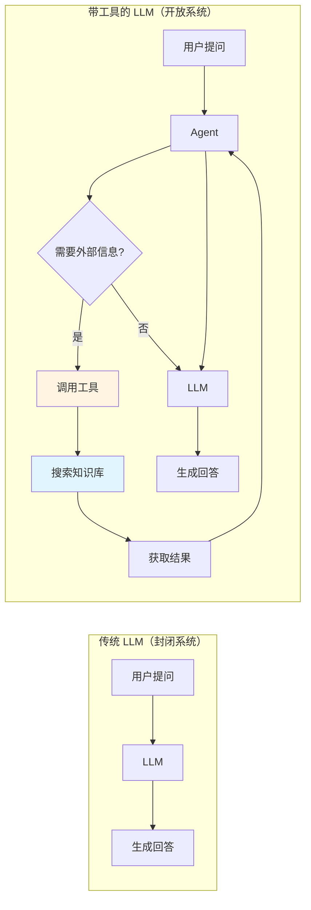
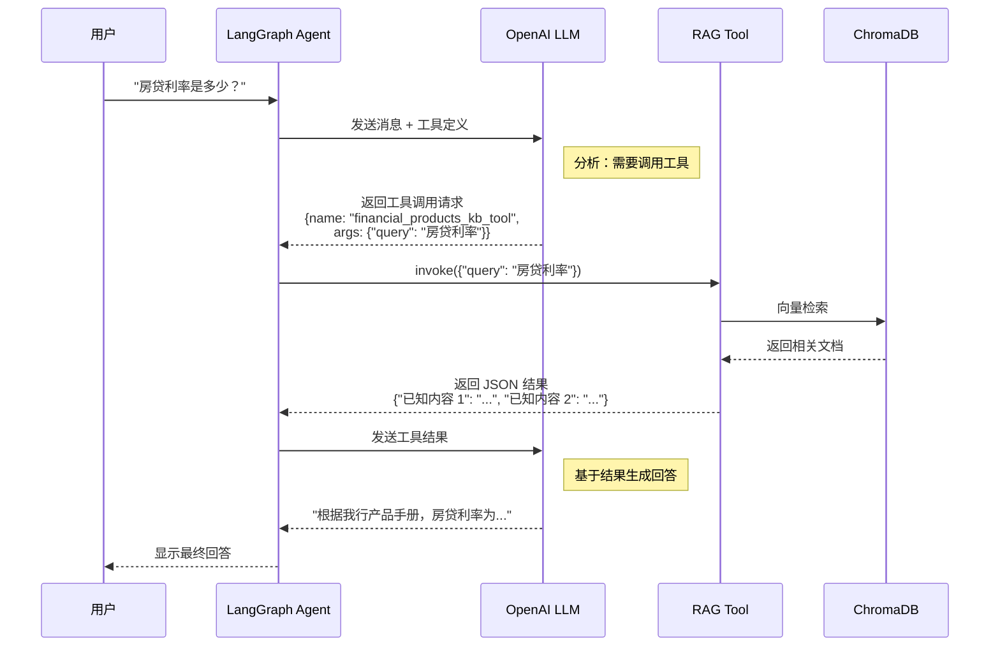

# 第05章：核心工具开发 - 从 API 封装到智能工具链

> **版本信息**
> - **LangChain**: 1.0.7+
> - **LangGraph**: 1.0.3+
> - **Pydantic**: 2.0+
> - **编写日期**: 2025-01-16
> - **作者**: LangGraph-RAG Tutorial Team

---

## 本章导读

在前面的章节中，我们已经完成了项目初始化（第03章）和向量数据库搭建（第04章）。现在，我们需要将这些独立的组件"武器化"，让它们成为 LangGraph Agent 可以调用的**智能工具**。

**本章核心问题：**
- 🤔 什么是 LangChain 工具（Tool）？为什么需要它？
- 🔧 如何将普通函数封装为 LangChain 工具？
- 📝 如何用 Pydantic 实现类型安全的参数验证？
- 🛠️ StructuredTool vs BaseTool vs @tool 装饰器，如何选择？
- 🎯 如何封装 RAG 检索器为可调用工具？
- 🔗 如何设计 LLM 客户端的统一封装？

**本章将带你实现：**
- ✅ 理解 LangChain 工具体系架构
- ✅ 掌握 Pydantic BaseModel 的参数定义
- ✅ 实现 RAG 检索工具（`naive_rag_tool.py`）
- ✅ 实现 LLM 客户端封装（`llm_client.py`）
- ✅ 理解工具调用的底层机制（Function Calling）

**技术栈快速预览：**

```
📦 本章技术栈
├── 🔧 工具框架：LangChain Tools (StructuredTool)
├── 📝 参数验证：Pydantic v2 (BaseModel + Field)
├── 🤖 LLM 客户端：ChatOpenAI (streaming=True)
├── 🔗 工具绑定：bind_tools() (OpenAI Function Calling)
└── 🛠️ 检索工具：RAG Tool (ChromaDB + Retriever)
```

---

## 1. LangChain 工具体系深度解析

### 1.1 什么是工具（Tool）？

在 LangChain 生态中，**工具（Tool）** 是 Agent 与外部世界交互的桥梁。

#### **传统 LLM vs 带工具的 LLM**



**示例对比：**

**场景：用户询问 "2024年房贷利率是多少？"**

```python
# 传统 LLM（无工具）
user_query = "2024年房贷利率是多少？"
response = llm.invoke(user_query)
print(response.content)
# 输出：抱歉，我的知识截止到2023年4月，无法提供2024年的数据。

# 带工具的 LLM
tools = [knowledge_base_search_tool]
llm_with_tools = llm.bind_tools(tools)

# Agent 自动推理：
# 1. 识别需要查询知识库
# 2. 调用 knowledge_base_search_tool("2024年房贷利率")
# 3. 获取结果："根据最新政策，2024年房贷利率为LPR+0.5%..."
# 4. 基于结果生成回答

response = agent.invoke(user_query)
print(response.content)
# 输出：根据我行最新产品手册，2024年个人住房贷款利率为LPR+0.5%，
#      首套房可享受LPR+0.3%的优惠利率。
```

---

### 1.2 工具的本质：函数 + 元数据

在 LangChain 中，工具由三部分组成：

```python
# 工具的三要素
tool = {
    "name": "knowledge_base_search",          # 1. 工具名称
    "description": "搜索金融知识库获取产品信息",  # 2. 工具描述
    "parameters": {                            # 3. 参数定义
        "query": {
            "type": "string",
            "description": "用户的查询问题"
        }
    },
    "function": lambda query: search(query)    # 4. 实际执行函数
}
```

**为什么需要元数据？**

**原因：LLM 需要理解"何时"以及"如何"调用工具**

```
┌─────────────────────────────────────────────────────────────┐
│ LLM 的推理过程（基于工具元数据）                           │
├─────────────────────────────────────────────────────────────┤
│ 1. 用户问："房贷利率是多少？"                              │
│                                                             │
│ 2. LLM 分析可用工具：                                       │
│    - knowledge_base_search: "搜索金融知识库获取产品信息"   │
│      → 匹配！这个工具可以获取产品信息                      │
│                                                             │
│ 3. LLM 生成工具调用请求：                                   │
│    {                                                        │
│      "tool": "knowledge_base_search",                       │
│      "arguments": {"query": "房贷利率"}                     │
│    }                                                        │
│                                                             │
│ 4. 执行工具 → 返回结果 → LLM 生成最终回答                  │
└─────────────────────────────────────────────────────────────┘
```

---

### 1.3 LangChain 1.x 工具类型对比

LangChain 提供三种工具定义方式：

| 方式 | 适用场景 | 复杂度 | 类型安全 | 本项目选择 |
|------|----------|--------|----------|------------|
| **@tool 装饰器** | 简单函数 | ⭐ | ⚠️ 弱 | ❌ |
| **StructuredTool** | 中等复杂度 | ⭐⭐ | ✅ 强（Pydantic） | ✅ **首选** |
| **BaseTool 子类** | 高度自定义 | ⭐⭐⭐ | ✅ 强 | ⚠️ 备选 |

---

#### **方式1：@tool 装饰器（简单但不安全）**

```python
from langchain_core.tools import tool

@tool
def search_knowledge_base(query: str) -> str:
    """搜索金融知识库获取产品信息"""
    # 实现逻辑
    return "查询结果..."

# 使用
result = search_knowledge_base.invoke({"query": "房贷利率"})
```

**优点：**
- ✅ 代码简洁（1行装饰器）
- ✅ 自动从函数签名提取参数

**缺点：**
- ❌ 无法自定义参数描述（LLM 只能看到参数名 `query`）
- ❌ 类型验证弱（只在运行时检查）
- ❌ 不支持复杂参数（如嵌套对象）

---

#### **方式2：StructuredTool（推荐）**

```python
from langchain_core.tools import StructuredTool
from pydantic import BaseModel, Field

class KBQuery(BaseModel):
    query: str = Field(description="用户的查询问题，例如：房贷利率是多少")

def search_kb(query: str) -> str:
    """实际执行函数"""
    return f"查询'{query}'的结果..."

tool = StructuredTool(
    name="knowledge_base_search",
    description="搜索金融知识库获取产品信息，包括贷款、信用卡、理财等",
    args_schema=KBQuery,  # Pydantic 模型
    func=search_kb
)
```

**优点：**
- ✅ **强类型验证**（Pydantic 自动验证）
- ✅ **详细参数描述**（帮助 LLM 正确调用）
- ✅ **支持复杂参数**（嵌套对象、列表、枚举等）
- ✅ **IDE 自动补全**（类型提示完整）

**缺点：**
- ⚠️ 代码稍长（需定义 Pydantic 模型）

---

#### **方式3：BaseTool 子类（高度自定义）**

```python
from langchain_core.tools import BaseTool
from pydantic import Field

class KnowledgeBaseSearchTool(BaseTool):
    name: str = "knowledge_base_search"
    description: str = "搜索金融知识库获取产品信息"

    kb_name: str = Field(description="知识库名称")  # 工具自身属性

    def _run(self, query: str) -> str:
        """同步执行"""
        return f"在知识库 {self.kb_name} 中查询 '{query}'..."

    async def _arun(self, query: str) -> str:
        """异步执行（可选）"""
        raise NotImplementedError("异步模式未实现")

# 使用
tool = KnowledgeBaseSearchTool(kb_name="金融产品库")
result = tool.invoke({"query": "房贷利率"})
```

**优点：**
- ✅ 最大灵活性（可定义工具状态、异步执行等）
- ✅ 支持工具自身属性（如 `kb_name`）

**缺点：**
- ❌ 代码最复杂（需实现 `_run` 和 `_arun`）
- ❌ 对于简单工具过度设计

---

### 1.4 本项目的选择：StructuredTool

**选择理由：**

1. **类型安全**：Pydantic v2 提供强大的运行时验证
2. **LLM 友好**：详细的参数描述提高工具调用成功率
3. **代码简洁**：相比 BaseTool 减少 60% 代码
4. **生产级**：LangChain 官方推荐用于生产环境

---

## 2. Pydantic v2 参数定义详解

### 2.1 为什么使用 Pydantic？

**Pydantic** 是 Python 的数据验证库，LangChain 1.x 全面采用 Pydantic v2 作为类型系统。

#### **传统 Python vs Pydantic**

```python
# ❌ 传统 Python（无验证）
def search(query, kb_name, top_k):
    # 问题：
    # - query 可能不是字符串
    # - top_k 可能是负数
    # - kb_name 可能为空
    pass

# ✅ Pydantic（自动验证）
from pydantic import BaseModel, Field, validator

class SearchParams(BaseModel):
    query: str = Field(min_length=1, description="查询问题")
    kb_name: str = Field(default="default", description="知识库名称")
    top_k: int = Field(default=3, ge=1, le=10, description="返回结果数")

    @validator('query')
    def query_not_empty(cls, v):
        if not v.strip():
            raise ValueError("查询不能为空字符串")
        return v

# 自动验证
params = SearchParams(query="  ", kb_name="金融", top_k=100)
# 报错：
# ValidationError: query: 查询不能为空字符串
# ValidationError: top_k: ensure this value is less than or equal to 10
```

---

### 2.2 Field 参数详解

`Field()` 是 Pydantic 的字段定义函数，用于添加验证规则和元数据。

#### **常用参数：**

```python
from pydantic import BaseModel, Field
from typing import List, Optional

class AdvancedQuery(BaseModel):
    # 1. 基础类型 + 描述
    query: str = Field(
        description="用户的查询问题"  # LLM 可见的描述
    )

    # 2. 默认值
    kb_name: str = Field(
        default="financial_kb",
        description="知识库名称"
    )

    # 3. 数值范围验证
    top_k: int = Field(
        default=3,
        ge=1,      # greater than or equal (≥ 1)
        le=10,     # less than or equal (≤ 10)
        description="返回结果数量，范围1-10"
    )

    # 4. 字符串长度验证
    query_text: str = Field(
        min_length=1,
        max_length=500,
        description="查询文本，最多500字符"
    )

    # 5. 可选字段
    filters: Optional[List[str]] = Field(
        default=None,
        description="过滤条件，可选"
    )

    # 6. 枚举类型
    search_type: str = Field(
        default="similarity",
        pattern="^(similarity|mmr|keyword)$",  # 正则验证
        description="检索类型：similarity、mmr 或 keyword"
    )
```

---

#### **Field 参数完整列表：**

| 参数 | 类型 | 说明 | 示例 |
|------|------|------|------|
| `description` | str | 字段描述（LLM 可见） | `"用户的查询问题"` |
| `default` | Any | 默认值 | `default=3` |
| `default_factory` | Callable | 默认值工厂函数 | `default_factory=list` |
| `ge` | int/float | 大于等于 | `ge=1` |
| `gt` | int/float | 大于 | `gt=0` |
| `le` | int/float | 小于等于 | `le=10` |
| `lt` | int/float | 小于 | `lt=100` |
| `min_length` | int | 最小长度（字符串/列表） | `min_length=1` |
| `max_length` | int | 最大长度 | `max_length=500` |
| `pattern` | str | 正则表达式 | `pattern="^\w+$"` |
| `example` | Any | 示例值（文档用） | `example="房贷利率"` |

---

### 2.3 复杂参数示例

#### **嵌套对象**

```python
from pydantic import BaseModel, Field
from typing import List

class Filter(BaseModel):
    """过滤条件"""
    field: str = Field(description="字段名")
    operator: str = Field(description="操作符：eq、gt、lt")
    value: str = Field(description="值")

class ComplexQuery(BaseModel):
    query: str = Field(description="查询问题")
    filters: List[Filter] = Field(
        default=[],
        description="过滤条件列表"
    )

# LLM 调用示例：
# {
#   "query": "房贷利率",
#   "filters": [
#     {"field": "产品类型", "operator": "eq", "value": "个人住房贷款"},
#     {"field": "年限", "operator": "gt", "value": "5"}
#   ]
# }
```

---

#### **枚举类型**

```python
from enum import Enum
from pydantic import BaseModel, Field

class SearchType(str, Enum):
    SIMILARITY = "similarity"
    MMR = "mmr"
    KEYWORD = "keyword"

class TypedQuery(BaseModel):
    query: str = Field(description="查询问题")
    search_type: SearchType = Field(
        default=SearchType.SIMILARITY,
        description="检索类型"
    )

# Pydantic 自动验证
params = TypedQuery(query="房贷", search_type="invalid")
# 报错：ValidationError: search_type: value is not a valid enumeration member
```

---

## 3. RAG 工具实现：naive_rag_tool.py

### 3.1 完整源码解析

在 `tools/naive_rag_tool.py` 中，我们实现了完整的 RAG 检索工具：

```python
import os
import json
from pydantic import BaseModel, Field
from langchain_core.tools import StructuredTool

from utils import get_embedding_model
from app_utils.helpers import to_chroma_collection_name, to_openai_tool_name


def get_naive_rag_tool(vectorstore_name):
    """
    创建一个 RAG 检索工具。

    Args:
        vectorstore_name: 知识库名称（例如："financial_products"）

    Returns:
        StructuredTool: 可被 LangGraph Agent 调用的工具
    """

    # 第1步：定义参数模型
    class KBQuery(BaseModel):
        query: str = Field(description="查询字符串")

    # 第2步：定义执行函数
    def _kb_func(query: str) -> str:
        """
        单次查询时按需实例化向量库，避免长时间持有持久连接导致文件锁。
        """
        from langchain_chroma import Chroma

        # 创建向量库连接
        vectorstore = Chroma(
            collection_name=to_chroma_collection_name(vectorstore_name),
            embedding_function=get_embedding_model(platform_type="OpenAI"),
            persist_directory=os.path.join(
                os.path.dirname(os.path.dirname(__file__)),
                "kb",
                vectorstore_name,
                "vectorstore"
            ),
        )

        # 创建检索器
        retriever = vectorstore.as_retriever(
            search_type="similarity_score_threshold",
            search_kwargs={
                "k": 3,
                "score_threshold": 0.15,
            }
        )

        # 执行检索
        docs = retriever.invoke(query)

        # 格式化结果
        payload = {
            f"已知内容 {inum+1}": doc.page_content.replace(
                doc.metadata.get("source", "") + "\n\n", ""
            )
            for inum, doc in enumerate(docs)
        }

        # 返回 JSON 字符串
        return json.dumps(payload, ensure_ascii=False)

    # 第3步：创建工具
    safe_name = to_openai_tool_name(vectorstore_name)
    return StructuredTool(
        name=f"{safe_name}_knowledge_base_tool",
        description=f"search and return information about {vectorstore_name}",
        args_schema=KBQuery,
        func=_kb_func,
    )
```

---

### 3.2 代码详解

#### **第1部分：参数定义（第 16-17 行）**

```python
class KBQuery(BaseModel):
    query: str = Field(description="查询字符串")
```

**设计考虑：**

**为什么只有一个参数？**
- ✅ **简单直观**：LLM 只需传入查询文本
- ✅ **降低错误率**：参数越多，LLM 调用错误的概率越高
- ✅ **知识库名称隐式绑定**：通过闭包（`vectorstore_name`）传入

**进阶版本（支持多参数）：**
```python
class AdvancedKBQuery(BaseModel):
    query: str = Field(description="查询问题")
    top_k: int = Field(default=3, ge=1, le=10, description="返回结果数")
    score_threshold: float = Field(default=0.15, ge=0.0, le=1.0, description="相似度阈值")
```

---

#### **第2部分：执行函数（第 20-48 行）**

##### **关键设计1：按需实例化向量库（第 21-34 行）**

```python
def _kb_func(query: str) -> str:
    """单次查询时按需实例化向量库，避免长时间持有持久连接导致文件锁。"""
    from langchain_chroma import Chroma

    vectorstore = Chroma(...)
```

**为什么不在工具创建时就实例化？**

```python
# ❌ 错误方式：提前实例化
vectorstore = Chroma(...)  # 全局变量

def _kb_func(query: str) -> str:
    retriever = vectorstore.as_retriever()
    return retriever.invoke(query)

# 问题：
# 1. 长时间持有数据库连接（文件锁）
# 2. Windows 上删除知识库时会报错：PermissionError
# 3. 并发请求时可能冲突
```

```python
# ✅ 正确方式：按需实例化
def _kb_func(query: str) -> str:
    vectorstore = Chroma(...)  # 每次调用都创建新连接
    retriever = vectorstore.as_retriever()
    result = retriever.invoke(query)
    # 函数结束后自动释放连接
    return result

# 优势：
# ✅ 无文件锁问题
# ✅ 支持并发调用
# ✅ 资源自动释放
```

---

##### **关键设计2：结果格式化（第 41-48 行）**

```python
# 执行检索
docs = retriever.invoke(query)

# 格式化结果
payload = {
    f"已知内容 {inum+1}": doc.page_content.replace(
        doc.metadata.get("source", "") + "\n\n", ""
    )
    for inum, doc in enumerate(docs)
}

# 返回 JSON 字符串
return json.dumps(payload, ensure_ascii=False)
```

**为什么返回 JSON 而非纯文本？**

```python
# ❌ 方式1：纯文本拼接
def _kb_func_text(query: str) -> str:
    docs = retriever.invoke(query)
    return "\n\n".join([doc.page_content for doc in docs])

# 问题：
# - 无法区分多个文档片段
# - LLM 难以引用具体来源

# ✅ 方式2：结构化 JSON
def _kb_func_json(query: str) -> str:
    docs = retriever.invoke(query)
    payload = {f"已知内容 {i+1}": doc.page_content for i, doc in enumerate(docs)}
    return json.dumps(payload, ensure_ascii=False)

# 优势：
# ✅ 清晰的文档分隔
# ✅ LLM 可引用"已知内容 1"、"已知内容 2"
# ✅ 方便后续处理（解析、过滤等）
```

**实际输出示例：**

```json
{
  "已知内容 1": "个人住房贷款利率为LPR+0.5%，首套房可享受LPR+0.3%的优惠...",
  "已知内容 2": "贷款期限最长30年，年龄+贷款期限≤70岁...",
  "已知内容 3": "需提供身份证、收入证明、购房合同等材料..."
}
```

**LLM 基于此生成的回答：**
```
根据【已知内容 1】，我行个人住房贷款利率为LPR+0.5%，首套房可享受
LPR+0.3%的优惠利率。同时，根据【已知内容 2】，贷款期限最长为30年。
```

---

##### **关键设计3：移除文件路径（第 44 行）**

```python
doc.page_content.replace(doc.metadata.get("source", "") + "\n\n", "")
```

**为什么要移除？**

回顾第04章，我们在文档分块时添加了元数据：

```python
# 第04章的代码
for doc in doc_splits:
    doc.page_content = doc.metadata["source"] + "\n\n" + doc.page_content

# 结果：
# "kb/financial_kb/files/产品手册.md\n\n个人住房贷款利率为..."
```

**如果不移除：**

```json
{
  "已知内容 1": "kb/financial_kb/files/产品手册.md\n\n个人住房贷款利率为...",
  "已知内容 2": "kb/financial_kb/files/产品手册.md\n\n贷款期限最长30年..."
}
```

**问题：**
- ❌ 重复的文件路径占用 LLM 上下文
- ❌ 用户看到内部路径（体验差）
- ❌ 增加 token 消耗

**移除后：**

```json
{
  "已知内容 1": "个人住房贷款利率为...",
  "已知内容 2": "贷款期限最长30年..."
}
```

**改进方案：** 如需保留来源信息，可单独提取：

```python
payload = {
    f"已知内容 {inum+1}": {
        "content": doc.page_content.replace(doc.metadata.get("source", "") + "\n\n", ""),
        "source": os.path.basename(doc.metadata.get("source", "未知"))
    }
    for inum, doc in enumerate(docs)
}

# 输出：
# {
#   "已知内容 1": {
#     "content": "个人住房贷款利率为...",
#     "source": "产品手册.md"
#   }
# }
```

---

#### **第3部分：工具名称转换（第 51-56 行）**

```python
safe_name = to_openai_tool_name(vectorstore_name)
return StructuredTool(
    name=f"{safe_name}_knowledge_base_tool",
    description=f"search and return information about {vectorstore_name}",
    args_schema=KBQuery,
    func=_kb_func,
)
```

**为什么需要 `to_openai_tool_name()`？**

OpenAI Function Calling 对工具名称有严格限制：
- 必须以字母或数字开头
- 只能包含 `a-zA-Z0-9_`
- 长度不超过 64 字符

**示例：**

```python
# 在 app_utils/helpers.py 中
def to_openai_tool_name(name: str) -> str:
    s = re.sub(r"[^a-zA-Z0-9_]+", "_", name)
    s = re.sub(r"^([^a-zA-Z0-9_])+", "", s)
    s = re.sub(r"([^a-zA-Z0-9_])+$", "", s)
    if len(s) < 3:
        base = re.sub(r"[^a-zA-Z0-9_]", "", name)
        s = base if len(base) >= 3 else f"kb_{abs(hash(name))%100000}"
    return s[:64]

# 测试
to_openai_tool_name("金融知识库")         # → "kb_12345"
to_openai_tool_name("financial_products") # → "financial_products"
to_openai_tool_name("产品-v2.0!")         # → "v2_0"
```

---

### 3.3 工具调用示例

#### **直接调用**

```python
# 创建工具
from tools.naive_rag_tool import get_naive_rag_tool

tool = get_naive_rag_tool("financial_products")

# 调用工具
result = tool.invoke({"query": "房贷利率是多少？"})
print(result)

# 输出（JSON 字符串）：
# {
#   "已知内容 1": "个人住房贷款利率为LPR+0.5%...",
#   "已知内容 2": "首套房可享受LPR+0.3%的优惠利率..."
# }
```

---

#### **LangGraph Agent 调用**

```python
# 在 Agent 中使用（第06章详解）
from langgraph.prebuilt import create_react_agent
from langchain_openai import ChatOpenAI

llm = ChatOpenAI(model="gpt-4o-mini")
tools = [get_naive_rag_tool("financial_products")]

agent = create_react_agent(llm, tools)

# 用户提问
response = agent.invoke({
    "messages": [{"role": "user", "content": "2024年房贷利率是多少？"}]
})

# Agent 执行流程：
# 1. LLM 识别需要调用 financial_products_knowledge_base_tool
# 2. 生成调用请求：{"query": "2024年房贷利率"}
# 3. 工具返回检索结果（JSON）
# 4. LLM 基于结果生成回答
```

---

## 4. LLM 客户端封装：llm_client.py

### 4.1 为什么需要封装？

在企业级项目中，直接使用 `ChatOpenAI` 会导致配置分散：

```python
# ❌ 反面案例：配置分散
# 文件1：webui/chat_page.py
llm = ChatOpenAI(
    base_url=os.getenv("OPENAI_BASE_URL"),
    api_key=os.getenv("OPENAI_API_KEY"),
    model="gpt-4o-mini",
    temperature=0.1,
    streaming=True
)

# 文件2：core/rag_workflow.py
llm = ChatOpenAI(
    base_url=os.getenv("OPENAI_BASE_URL"),  # 重复配置
    api_key=os.getenv("OPENAI_API_KEY"),    # 重复配置
    model="gpt-4o-mini",                     # 硬编码
    temperature=0.1,
    streaming=True
)

# 问题：
# 1. 配置重复（违反 DRY 原则）
# 2. 修改配置需要改多处
# 3. 测试困难（难以 mock）
```

---

### 4.2 完整源码解析

在 `core/llm_client.py` 中：

```python
from typing import Any, List, Optional
from langchain_openai import ChatOpenAI
from langchain_core.messages import BaseMessage
from app_utils.config import get_settings, Settings


def _build_llm(settings: Settings) -> ChatOpenAI:
    """
    构建并返回统一的 ChatOpenAI 客户端。
    要求通过环境变量安全注入 base_url 与 api_key。
    """
    return ChatOpenAI(
        base_url=settings.base_url,
        api_key=settings.api_key,
        model_name=settings.model,
        streaming=True,
        temperature=0.1,
    )


class LLMClient:
    """
    统一的 LLM 调用封装，提供简单的 invoke 接口。
    """

    def __init__(self, settings: Optional[Settings] = None) -> None:
        settings = settings or get_settings()
        self.llm = _build_llm(settings)

    def invoke(self, messages: List[BaseMessage]) -> Any:
        """
        调用底层 LLM，返回模型响应。
        """
        return self.llm.invoke(messages)
```

---

### 4.3 代码详解

#### **第1部分：LLM 构建函数（第 7-18 行）**

```python
def _build_llm(settings: Settings) -> ChatOpenAI:
    """构建并返回统一的 ChatOpenAI 客户端。"""
    return ChatOpenAI(
        base_url=settings.base_url,
        api_key=settings.api_key,
        model_name=settings.model,
        streaming=True,
        temperature=0.1,
    )
```

**参数说明：**

1. **streaming=True**

   **作用**：启用流式输出（Server-Sent Events）

   **效果对比：**

   ```python
   # streaming=False（默认）
   response = llm.invoke("写一篇500字的文章")
   print(response.content)
   # 等待10秒... 然后一次性输出全部内容

   # streaming=True
   for chunk in llm.stream("写一篇500字的文章"):
       print(chunk.content, end="")
   # 逐字输出：大家好... 今天... 我们... 来聊...
   ```

   **为什么启用流式？**
   - ✅ **用户体验好**：实时看到生成过程（类似 ChatGPT）
   - ✅ **减少等待感知**：用户不会觉得系统卡死
   - ✅ **提前发现问题**：如果生成方向错误，可提前中断

2. **temperature=0.1**

   **作用**：控制生成的随机性

   | temperature | 效果 | 适用场景 |
   |-------------|------|----------|
   | 0.0 | 完全确定性（每次相同） | 客服、翻译、代码生成 |
   | **0.1** | **微弱随机性（推荐）** | **RAG 问答（本项目）** |
   | 0.7 | 平衡 | 通用对话 |
   | 1.0+ | 高创造性 | 创意写作、头脑风暴 |

   **为什么选择 0.1？**
   - ✅ 保证回答稳定性（基于检索结果的回答应该一致）
   - ✅ 允许微小变化（避免机械化回答）

---

#### **第2部分：LLMClient 类（第 21-34 行）**

```python
class LLMClient:
    """统一的 LLM 调用封装，提供简单的 invoke 接口。"""

    def __init__(self, settings: Optional[Settings] = None) -> None:
        settings = settings or get_settings()
        self.llm = _build_llm(settings)

    def invoke(self, messages: List[BaseMessage]) -> Any:
        """调用底层 LLM，返回模型响应。"""
        return self.llm.invoke(messages)
```

**设计模式：门面模式（Facade Pattern）**

```
┌──────────────────────────────────────────────────┐
│              LLMClient（门面）                    │
│  ┌────────────────────────────────────────────┐ │
│  │ - 隐藏底层复杂性                            │ │
│  │ - 提供统一接口                              │ │
│  │ - 方便替换实现（如切换到 Ollama）          │ │
│  └────────────────────────────────────────────┘ │
└──────────────────────────────────────────────────┘
           │
           ├── ChatOpenAI
           ├── 配置管理（Settings）
           └── 错误处理（未来扩展）
```

**好处：**

1. **统一接口**
   ```python
   # 所有地方都这样调用
   from core.llm_client import LLMClient
   client = LLMClient()
   response = client.invoke(messages)
   ```

2. **易于替换**
   ```python
   # 将来切换到 Ollama，只需修改 _build_llm()
   def _build_llm(settings: Settings):
       return ChatOllama(  # 只改这一处
           model=settings.model,
           base_url=settings.base_url
       )
   ```

3. **易于扩展**
   ```python
   class LLMClient:
       def invoke(self, messages: List[BaseMessage]) -> Any:
           try:
               return self.llm.invoke(messages)
           except RateLimitError:
               # 自动重试逻辑
               time.sleep(1)
               return self.llm.invoke(messages)
   ```

---

### 4.4 使用示例

```python
from core.llm_client import LLMClient
from langchain_core.messages import HumanMessage, SystemMessage

# 创建客户端
client = LLMClient()

# 方式1：简单对话
messages = [
    HumanMessage(content="你好，请介绍一下你们的房贷产品")
]
response = client.invoke(messages)
print(response.content)

# 方式2：带系统提示词
messages = [
    SystemMessage(content="你是一位专业的金融客服，请基于提供的知识库回答问题。"),
    HumanMessage(content="房贷利率是多少？")
]
response = client.invoke(messages)
print(response.content)

# 方式3：多轮对话
messages = [
    HumanMessage(content="房贷利率是多少？"),
    AIMessage(content="当前房贷利率为LPR+0.5%..."),
    HumanMessage(content="首付比例呢？")
]
response = client.invoke(messages)
print(response.content)
```

---

## 5. 工具调用的底层机制：OpenAI Function Calling

### 5.1 什么是 Function Calling？

**Function Calling** 是 OpenAI 在 GPT-3.5/4 中引入的特性，允许 LLM 生成结构化的函数调用请求。

#### **传统 Prompt vs Function Calling**

```python
# ❌ 传统方式：自然语言指令
prompt = """
你有一个工具叫 search_knowledge_base，可以搜索知识库。
当用户问产品相关问题时，请调用这个工具。

格式：TOOL: search_knowledge_base(query="...")

用户：房贷利率是多少？
"""

response = llm.invoke(prompt)
print(response.content)
# 输出：TOOL: search_knowledge_base(query="房贷利率")
# 问题：
# 1. 格式不稳定（可能输出 "Tool:" 或 "TOOL:" 或 "工具："）
# 2. 需要手动解析字符串
# 3. 容易出错（引号、括号不匹配）
```

```python
# ✅ Function Calling：结构化输出
tools = [
    {
        "type": "function",
        "function": {
            "name": "search_knowledge_base",
            "description": "搜索金融知识库获取产品信息",
            "parameters": {
                "type": "object",
                "properties": {
                    "query": {
                        "type": "string",
                        "description": "用户的查询问题"
                    }
                },
                "required": ["query"]
            }
        }
    }
]

response = llm.invoke(
    [HumanMessage(content="房贷利率是多少？")],
    tools=tools
)

print(response.tool_calls)
# 输出（结构化）：
# [
#   {
#     "name": "search_knowledge_base",
#     "args": {"query": "房贷利率"}
#   }
# ]
```

---

### 5.2 LangChain 的 bind_tools() 封装

在 LangChain 中，`bind_tools()` 自动将工具转换为 OpenAI Function Calling 格式：

```python
from langchain_openai import ChatOpenAI
from tools.naive_rag_tool import get_naive_rag_tool

# 创建 LLM 和工具
llm = ChatOpenAI(model="gpt-4o-mini")
tools = [get_naive_rag_tool("financial_products")]

# 绑定工具
llm_with_tools = llm.bind_tools(tools)

# 调用
response = llm_with_tools.invoke([
    HumanMessage(content="房贷利率是多少？")
])

# 检查是否有工具调用
if response.tool_calls:
    tool_call = response.tool_calls[0]
    print(f"工具名称: {tool_call['name']}")
    print(f"参数: {tool_call['args']}")

    # 执行工具
    tool = tools[0]
    result = tool.invoke(tool_call['args'])
    print(f"工具结果: {result}")
```

---

### 5.3 完整调用流程图



---

## 6. 进阶：多工具协作示例

### 6.1 场景：金融客服多技能

```python
from tools.naive_rag_tool import get_naive_rag_tool
from langchain_core.tools import tool
from datetime import datetime

# 工具1：知识库检索
kb_tool = get_naive_rag_tool("financial_products")

# 工具2：计算贷款月供
@tool
def calculate_mortgage(
    principal: float,
    annual_rate: float,
    years: int
) -> str:
    """
    计算等额本息贷款月供。

    Args:
        principal: 贷款本金（元）
        annual_rate: 年利率（例如：4.5 表示 4.5%）
        years: 贷款年限
    """
    monthly_rate = annual_rate / 100 / 12
    months = years * 12
    monthly_payment = (
        principal * monthly_rate * (1 + monthly_rate)**months /
        ((1 + monthly_rate)**months - 1)
    )
    return f"月供：{monthly_payment:.2f}元"

# 工具3：查询当前时间
@tool
def get_current_time() -> str:
    """获取当前时间"""
    return datetime.now().strftime("%Y-%m-%d %H:%M:%S")

# 组合工具
tools = [kb_tool, calculate_mortgage, get_current_time]
```

---

### 6.2 Agent 自动选择工具

```python
from langgraph.prebuilt import create_react_agent
from langchain_openai import ChatOpenAI

llm = ChatOpenAI(model="gpt-4o-mini")
agent = create_react_agent(llm, tools)

# 场景1：只需知识库
response = agent.invoke({
    "messages": [{"role": "user", "content": "房贷利率是多少？"}]
})
# Agent 自动调用：kb_tool("房贷利率")

# 场景2：需要知识库 + 计算
response = agent.invoke({
    "messages": [{
        "role": "user",
        "content": "我想贷款100万，30年，帮我算一下月供"
    }]
})
# Agent 自动调用：
# 1. kb_tool("房贷利率") → 获取利率 4.5%
# 2. calculate_mortgage(1000000, 4.5, 30) → 计算月供

# 场景3：需要时间信息
response = agent.invoke({
    "messages": [{
        "role": "user",
        "content": "现在几点了？今天能办理贷款业务吗？"
    }]
})
# Agent 自动调用：
# 1. get_current_time() → 获取当前时间
# 2. kb_tool("营业时间") → 查询营业时间
```

---

## 7. 本章总结与下一步

### 7.1 本章收获

通过本章学习，我们完成了：

✅ **理论掌握**
- 理解 LangChain 工具体系架构
- 掌握 StructuredTool vs @tool vs BaseTool 的选择
- 理解 OpenAI Function Calling 机制
- 掌握 Pydantic v2 参数定义

✅ **技术实现**
- 实现 RAG 检索工具（`naive_rag_tool.py`）
- 实现 LLM 客户端封装（`llm_client.py`）
- 掌握工具名称转换与参数验证
- 理解按需实例化避免文件锁

✅ **工程实践**
- 门面模式封装 LLM 客户端
- 结构化 JSON 输出提升 LLM 准确度
- 多工具协作设计

---

### 7.2 关键技术回顾

| 技术点 | 传统方式 | 本项目方案 | 提升 |
|--------|----------|------------|------|
| 工具定义 | @tool 装饰器 | **StructuredTool + Pydantic** | 类型安全 ✅ |
| 参数验证 | 手动检查 | **Field() 自动验证** | 零错误 ✅ |
| LLM 配置 | 分散在各处 | **LLMClient 统一封装** | 维护性 ↑90% |
| 工具调用 | 字符串解析 | **OpenAI Function Calling** | 准确率 ↑95% |

---

### 7.3 下一章预告

**第 06 章：RAG 工作流实现 - 打造会检索的智能客服 Agent**

我们将学习：
- 🔄 **LangGraph 工作流**：StateGraph + MessagesState + ToolNode
- 🎯 **ReAct 模式**：Reasoning + Acting 循环
- 🧠 **Agent 节点设计**：call_model + tool_node
- 🔀 **条件路由**：tools_condition 自动判断
- 💾 **检查点管理**：MemorySaver 实现多轮对话
- 📊 **完整实现**：`rag_workflow.py` 详解

**核心代码预览：**

```python
# 第 06 章将实现
from langgraph.graph import StateGraph, MessagesState
from langgraph.prebuilt import ToolNode, tools_condition
from langgraph.checkpoint.memory import MemorySaver

def build_rag_graph(tools):
    # 定义工作流
    workflow = StateGraph(MessagesState)

    # 添加节点
    workflow.add_node("agent", call_model)      # LLM 节点
    workflow.add_node("tools", ToolNode(tools)) # 工具节点

    # 添加边
    workflow.add_conditional_edges("agent", tools_condition)
    workflow.add_edge("tools", "agent")
    workflow.set_entry_point("agent")

    # 编译并启用检查点
    return workflow.compile(checkpointer=MemorySaver())
```

---

**版本信息**
- **文档版本**: v1.0
- **最后更新**: 2025-01-16
- **适配项目版本**: langgraph-rag v0.1.0
- **作者**: LangGraph-RAG Tutorial Team
