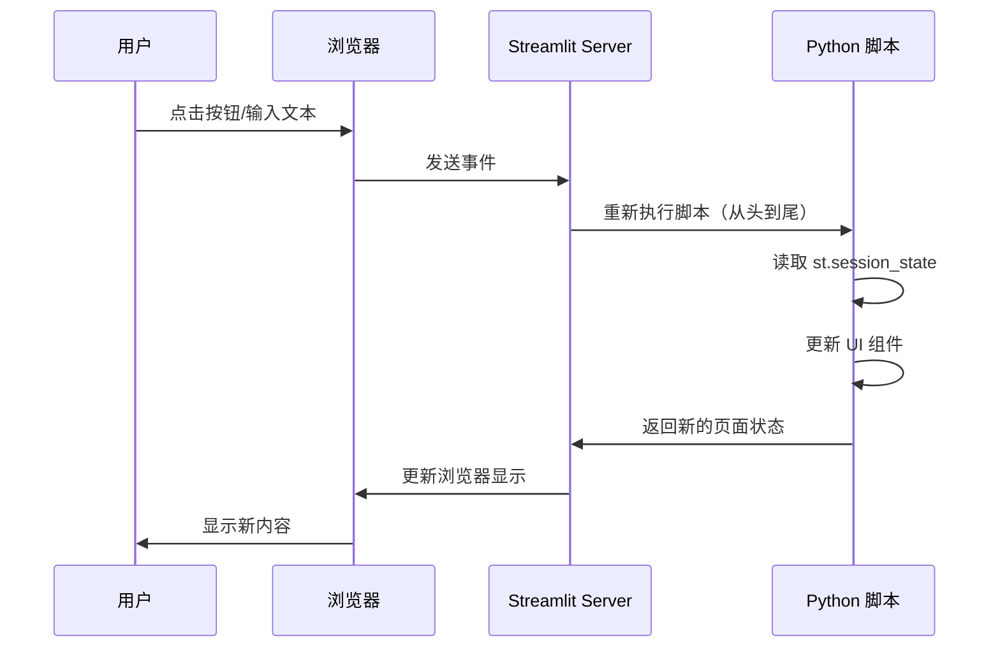

# 第07章：Streamlit Web界面开发 - 构建生产级对话系统

> **版本信息**
> - **Streamlit**: 1.51.0+
> - **LangGraph**: 1.0.3+
> - **编写日期**: 2025-01-16
> - **作者**: LangGraph-RAG Tutorial Team

---

## 本章导读

经过前面章节的学习，我们已经完成了后端核心功能：
- ✅ 第03章：项目环境搭建
- ✅ 第04章：向量数据库构建
- ✅ 第05章：工具开发
- ✅ 第06章：RAG 工作流实现

现在，是时候为用户提供一个**美观、易用的 Web 界面**了。本章将使用 Streamlit 快速构建生产级对话系统。

**本章核心问题：**
- 🌐 为什么选择 Streamlit 而非 Flask/Django？
- 💬 如何实现类似 ChatGPT 的聊天界面？
- 🔄 如何集成 LangGraph Agent 实现流式输出？
- 📊 如何显示工具调用过程（知识库检索状态）？
- 🎨 如何优化 UI/UX（加载动画、错误提示、清空会话）？
- 💾 如何管理会话状态（session_state）？

**本章将带你实现：**
- ✅ 理解 Streamlit 的核心组件与设计哲学
- ✅ 构建完整的聊天界面（`rag_chat_page.py`）
- ✅ 实现流式输出与工具调用可视化
- ✅ 掌握 session_state 的状态管理
- ✅ 优化用户体验（响应式设计、错误处理）

**技术栈快速预览：**

```
📦 本章技术栈
├── 🌐 Web 框架：Streamlit 1.51.0+
├── 💬 聊天组件：st.chat_message、st.chat_input
├── 📊 状态管理：st.session_state
├── 🔄 流式输出：st.write_stream
├── 🎨 布局组件：st.sidebar、st.columns、st.popover
└── 🛠️ Agent 集成：LangGraph + ToolNode
```

---

## 1. Streamlit 核心理念

### 1.1 为什么选择 Streamlit？

#### **Web 框架对比**

| 框架 | 学习曲线 | 开发速度 | 适用场景 | 本项目适配度 |
|------|----------|----------|----------|--------------|
| **Streamlit** | ⭐ | 🚀 极快（纯 Python） | 数据应用、原型开发 | ✅ **完美** |
| Flask | ⭐⭐ | ⭐⭐ | 小型 Web 应用 | ⚠️ 需要前端知识 |
| Django | ⭐⭐⭐⭐ | ⭐ | 大型企业应用 | ❌ 过度复杂 |
| FastAPI | ⭐⭐⭐ | ⭐⭐⭐ | RESTful API | ❌ 需要单独前端 |

---

#### **Streamlit 核心优势**

**1. 纯 Python，零前端代码**

```python
# Streamlit（10行代码）
import streamlit as st

st.title("金融智能客服")

user_input = st.chat_input("请输入问题")
if user_input:
    with st.chat_message("user"):
        st.write(user_input)

    with st.chat_message("assistant"):
        st.write("您好，我是智能客服...")

# Flask + HTML + JavaScript（约 100 行代码）
# Flask 后端：
@app.route('/chat', methods=['POST'])
def chat():
    data = request.json
    response = generate_response(data['message'])
    return jsonify({'response': response})

# HTML 前端（chat.html）：
# <div id="chat-container">...</div>
# <input id="user-input" ...>
# <button onclick="sendMessage()">发送</button>

# JavaScript：
# function sendMessage() {
#     const input = document.getElementById('user-input').value;
#     fetch('/chat', {
#         method: 'POST',
#         body: JSON.stringify({message: input}),
#         ...
#     })
# }
```

**2. 组件丰富，开箱即用**

```python
# Streamlit 内置组件（部分）
st.chat_message()        # 聊天气泡
st.chat_input()          # 聊天输入框
st.file_uploader()       # 文件上传
st.sidebar               # 侧边栏
st.columns()             # 多列布局
st.status()              # 状态提示
st.spinner()             # 加载动画
st.write_stream()        # 流式输出
```

**3. 自动响应式设计**

```python
# Streamlit 自动适配移动端
st.chat_message("user")  # 自动适配屏幕宽度

# Flask 需要手动写 CSS
<style>
@media (max-width: 768px) {
  .chat-container {
    width: 100%;
  }
}
</style>
```

---

### 1.2 Streamlit 运行机制

#### **自顶向下执行模型**

```python
import streamlit as st

# 每次用户交互，整个脚本重新执行
print("脚本开始执行")  # 每次都会打印

if st.button("点击"):
    st.write("按钮被点击")  # 点击后重新执行整个脚本

# 问题：如何保存状态？
# 答案：st.session_state
```

**关键概念：**
- ✅ **每次交互，脚本重新执行**（从头到尾）
- ✅ **st.session_state**：跨执行保存状态
- ✅ **缓存机制**：避免重复计算（`@st.cache_data`）

---

#### **执行流程图**



---

## 2. 核心组件详解

### 2.1 聊天组件

#### **st.chat_message()**

**作用：**显示聊天气泡（用户或助手）

**基础用法：**

```python
import streamlit as st

# 用户消息
with st.chat_message("user"):
    st.write("你好，请介绍一下房贷产品")

# 助手消息
with st.chat_message("assistant"):
    st.write("您好，我们提供以下房贷产品...")
```

**高级用法：自定义头像**

```python
# 方式1：使用 emoji
with st.chat_message("user", avatar="🧑‍💻"):
    st.write("你好")

# 方式2：使用 Base64 图片
from utils import get_img_base64

with st.chat_message("assistant", avatar=get_img_base64("avatar.png")):
    st.write("您好")
```

---

#### **st.chat_input()**

**作用：**聊天输入框（固定在页面底部）

**基础用法：**

```python
user_input = st.chat_input("请输入您的问题")

if user_input:
    # 用户输入后会触发脚本重新执行，user_input 有值
    with st.chat_message("user"):
        st.write(user_input)
```

**高级用法：配合 session_state**

```python
# 初始化聊天历史
if "messages" not in st.session_state:
    st.session_state.messages = []

# 显示历史消息
for msg in st.session_state.messages:
    with st.chat_message(msg["role"]):
        st.write(msg["content"])

# 新消息输入
if user_input := st.chat_input("请输入问题"):
    # 添加用户消息
    st.session_state.messages.append({"role": "user", "content": user_input})

    # 显示用户消息
    with st.chat_message("user"):
        st.write(user_input)

    # 生成助手回复
    response = "这是助手的回复..."

    # 添加助手消息
    st.session_state.messages.append({"role": "assistant", "content": response})

    # 显示助手消息
    with st.chat_message("assistant"):
        st.write(response)
```

---

### 2.2 流式输出

#### **st.write_stream()**

**作用：**逐字显示流式输出（类似 ChatGPT 效果）

**基础示例：**

```python
import time

def response_generator():
    response = "根据我行最新政策，个人住房贷款利率为LPR+0.5%..."
    for word in response:
        yield word
        time.sleep(0.05)  # 模拟延迟

with st.chat_message("assistant"):
    st.write_stream(response_generator())
```

**集成 LangGraph Agent：**

```python
from core.rag_workflow import build_rag_graph
from tools.naive_rag_tool import get_naive_rag_tool

# 创建 Agent
tools = [get_naive_rag_tool("financial_products")]
agent = build_rag_graph(tools)

# 流式输出
def stream_agent_response(user_input):
    for chunk in agent.stream({
        "messages": [{"role": "user", "content": user_input}]
    }, config={"configurable": {"thread_id": "user_123"}}):
        if "agent" in chunk:
            messages = chunk["agent"]["messages"]
            if messages and hasattr(messages[-1], "content"):
                yield messages[-1].content

# 使用
with st.chat_message("assistant"):
    response = st.write_stream(stream_agent_response(user_input))
```

---

### 2.3 状态管理

#### **st.session_state**

**作用：**跨脚本执行保存状态（类似全局变量）

**基础用法：**

```python
# 初始化（只在第一次执行时）
if "counter" not in st.session_state:
    st.session_state.counter = 0

# 显示
st.write(f"计数器: {st.session_state.counter}")

# 更新
if st.button("增加"):
    st.session_state.counter += 1
    st.rerun()  # 重新执行脚本以更新显示
```

**聊天历史示例：**

```python
# 初始化聊天历史
if "chat_history" not in st.session_state:
    st.session_state.chat_history = [
        {"role": "assistant", "content": "你好，我是智能客服"}
    ]

# 显示历史
for msg in st.session_state.chat_history:
    with st.chat_message(msg["role"]):
        st.write(msg["content"])

# 添加新消息
if user_input := st.chat_input("请输入问题"):
    st.session_state.chat_history.append({"role": "user", "content": user_input})

    response = "这是回复..."
    st.session_state.chat_history.append({"role": "assistant", "content": response})

    st.rerun()  # 重新执行以显示新消息
```

---

### 2.4 布局组件

#### **st.sidebar**

**作用：**侧边栏（配置、设置）

```python
with st.sidebar:
    st.title("设置")

    # 知识库选择
    kb_names = ["financial_kb", "product_kb"]
    selected_kb = st.multiselect("选择知识库", kb_names, default=kb_names)

    # 模型配置
    temperature = st.slider("Temperature", 0.0, 1.0, 0.1)

    # 清空按钮
    if st.button("清空对话"):
        st.session_state.chat_history = []
        st.rerun()
```

---

#### **st.columns()**

**作用：**多列布局

```python
cols = st.columns([1, 3, 1])  # 宽度比例：1:3:1

with cols[0]:
    st.button("⚙️")  # 设置按钮

with cols[1]:
    user_input = st.chat_input("请输入问题")  # 输入框

with cols[2]:
    st.button("🗑️")  # 清空按钮
```

---

#### **st.popover()**

**作用：**弹出框（配置面板）

```python
with st.popover("⚙️ 设置"):
    temperature = st.slider("Temperature", 0.0, 1.0, 0.1)
    history_len = st.slider("历史消息长度", 1, 10, 5)
```

---

### 2.5 状态提示

#### **st.status()**

**作用：**显示可折叠的状态信息

```python
with st.status("正在查询知识库...", expanded=True) as status:
    st.write("正在检索文档...")
    time.sleep(1)

    st.write("已找到 3 个相关文档")
    st.code('{"已知内容 1": "..."}')

    status.update(label="查询完成！", state="complete", expanded=False)
```

**状态类型：**
- `state="running"`：进行中（默认，蓝色）
- `state="complete"`：成功（绿色）
- `state="error"`：错误（红色）

---

## 3. 完整实现：rag_chat_page.py

### 3.1 整体架构

```
┌─────────────────────────────────────────────────┐
│              rag_chat_page.py 架构               │
├─────────────────────────────────────────────────┤
│                                                 │
│  1. get_rag_graph()                             │
│     └─ 构建 LangGraph 工作流                    │
│                                                 │
│  2. graph_response()                            │
│     ├─ 执行 Agent（流式）                       │
│     ├─ 处理 AIMessage（生成回复）               │
│     └─ 处理 ToolMessage（显示检索结果）         │
│                                                 │
│  3. get_rag_chat_response()                     │
│     └─ 封装调用逻辑                             │
│                                                 │
│  4. display_chat_history()                      │
│     └─ 显示历史消息（包含工具调用）             │
│                                                 │
│  5. clear_chat_history()                        │
│     └─ 清空会话                                 │
│                                                 │
│  6. rag_chat_page()                             │
│     └─ 主页面逻辑                               │
│                                                 │
└─────────────────────────────────────────────────┘
```

---

### 3.2 核心函数详解

#### **函数1：get_rag_graph()（第 22-58 行）**

```python
def get_rag_graph(platform, model, temperature, selected_kbs, KBS):
    """构建 RAG 工作流"""
    # 第1步：获取选中的工具
    tools = [KBS[k] for k in selected_kbs]

    # 第2步：创建工具节点
    tool_node = ToolNode(tools)

    # 第3步：定义 Agent 节点
    def call_model(state):
        llm = get_chatllm(platform, model, temperature=temperature)
        llm_with_tools = llm.bind_tools(tools)
        return {"messages": [llm_with_tools.invoke(state["messages"])]}

    # 第4步：构建状态图
    workflow = StateGraph(MessagesState)
    workflow.add_node("agent", call_model)
    workflow.add_node("tools", tool_node)
    workflow.add_conditional_edges("agent", tools_condition)
    workflow.add_edge("tools", "agent")
    workflow.set_entry_point("agent")

    # 第5步：编译并返回
    checkpointer = MemorySaver()
    return workflow.compile(checkpointer=checkpointer)
```

**与 core/rag_workflow.py 的区别：**

| 项目 | core/rag_workflow.py | webui/rag_chat_page.py |
|------|----------------------|------------------------|
| **参数化** | 固定配置 | **动态配置**（平台、模型、温度） |
| **工具选择** | 固定工具列表 | **用户选择**（多知识库） |
| **适用场景** | 后端逻辑 | **Web 界面**（灵活性） |

---

#### **函数2：graph_response()（第 61-122 行）**

这是最核心的函数，处理流式输出和工具调用可视化。

**完整代码：**

```python
def graph_response(graph, input, tool_name_map):
    """处理图的流式响应"""
    for event in graph.invoke(
        {"messages": input},
        config={"configurable": {"thread_id": 42}},
        stream_mode="messages",  # 逐消息流式输出
    ):
        # 情况1：AI 生成内容
        if isinstance(event[0], (AIMessageChunk, AIMessage)):
            if len(event[0].tool_calls):
                # 有工具调用：记录到 session_state
                st.session_state["rag_tool_calls"].append({
                    "status": "正在查询...",
                    "knowledge_base": tool_name_map.get(
                        event[0].tool_calls[0]["name"],
                        event[0].tool_calls[0]["name"].replace("_knowledge_base_tool", "")
                    ),
                    "query": ""
                })
            yield event[0].content  # 流式输出文本

        # 情况2：工具执行完成
        elif type(event[0]) == ToolMessage:
            # 显示检索状态
            status_placeholder = st.empty()
            with status_placeholder.status("正在查询...", expanded=True) as s:
                st.write("已调用 `", tool_name_map.get(
                    event[0].name,
                    event[0].name.replace("_knowledge_base_tool", "")
                ), "` 知识库进行查询")

                st.write("知识库检索结果：")
                st.code(event[0].content, wrap_lines=True)

                s.update(label="已完成知识库检索！", expanded=False)

            # 保存工具调用结果
            st.session_state["rag_tool_calls"][-1]["status"] = "已完成知识库检索！"
            st.session_state["rag_tool_calls"][-1]["content"] = json.loads(event[0].content)
```

**关键设计：**

1. **stream_mode="messages"**
   - 逐消息流式输出（而非逐节点）
   - 可以实时捕获 AI 的输出

2. **两种事件类型**
   - `AIMessage`：LLM 生成的内容（包含 tool_calls）
   - `ToolMessage`：工具执行的结果

3. **工具调用可视化**
   ```python
   with st.status("正在查询...", expanded=True) as s:
       st.write("已调用 `financial_kb` 知识库")
       st.code('{"已知内容 1": "..."}')
       s.update(label="查询完成！", expanded=False)
   ```

---

#### **函数3：display_chat_history()（第 132-147 行）**

```python
def display_chat_history():
    """显示聊天历史"""
    for message in st.session_state["rag_chat_history_with_tool_call"]:
        with st.chat_message(
            message["role"],
            avatar=get_img_base64("chatchat_avatar.png") if message["role"] == "assistant" else None
        ):
            # 显示工具调用（如果有）
            if "tool_calls" in message.keys():
                for tool_call in message["tool_calls"]:
                    with st.status(tool_call["status"], expanded=False):
                        st.write("已调用 `", tool_call["knowledge_base"], "` 知识库进行查询")
                        st.write("知识库检索结果：")
                        # 可以继续显示 tool_call["content"]

            # 显示消息内容
            st.write(message["content"])
```

**设计亮点：**
- ✅ 工具调用历史也保存（可追溯）
- ✅ 折叠显示（默认收起，节省空间）
- ✅ 自定义头像（品牌化）

---

#### **函数4：rag_chat_page()（第 161-241 行）**

**主页面逻辑：**

```python
def rag_chat_page():
    # 第1步：页面标题
    st.markdown(
        "<h2 style='text-align:center;'>基于 LangChain 1.x + LangGraph 1.x + RAG 的金融智能客服</h2>",
        unsafe_allow_html=True
    )

    # 第2步：加载知识库
    kbs = get_kb_names()
    KBS = {k: get_naive_rag_tool(k) for k in kbs}
    tool_name_map = {KBS[k].name: k for k in kbs}

    # 第3步：初始化 session_state
    if "rag_chat_history" not in st.session_state:
        st.session_state["rag_chat_history"] = [
            {"role": "assistant", "content": "你好，我是智能客服助手..."}
        ]
    if "rag_chat_history_with_tool_call" not in st.session_state:
        st.session_state["rag_chat_history_with_tool_call"] = [
            {"role": "assistant", "content": "你好，我是智能客服助手..."}
        ]
    if "rag_tool_calls" not in st.session_state:
        st.session_state["rag_tool_calls"] = []

    # 第4步：侧边栏（知识库选择）
    with st.sidebar:
        if not kbs:
            st.info("当前暂无本地知识库")
            selected_kbs = []
        else:
            selected_kbs = st.multiselect("请选择对话中可使用的知识库", kbs, default=kbs)

    # 第5步：显示历史消息
    display_chat_history()

    # 第6步：底部输入区域
    with st._bottom:
        cols = st.columns([1.2, 10, 1])

        # 配置面板
        with cols[0].popover("⚙️", use_container_width=True):
            platform = st.selectbox("模型加载方式", PLATFORMS)
            model = st.selectbox("模型", get_llm_models(platform))
            temperature = st.slider("Temperature", 0.1, 1.0, 0.1)
            history_len = st.slider("历史消息长度", 1, 10, 5)

        # 输入框
        input = cols[1].chat_input("请输入您的问题")

        # 清空按钮
        cols[2].button("🗑️", help="清空对话", on_click=clear_chat_history)

    # 第7步：处理用户输入
    if input:
        # 显示用户消息
        with st.chat_message("user"):
            st.write(input)

        # 添加到历史
        st.session_state["rag_chat_history"] += [{"role": "user", "content": input}]
        st.session_state["rag_chat_history_with_tool_call"] += [{"role": "user", "content": input}]

        # 获取 Agent 响应（流式）
        stream_response = get_rag_chat_response(
            platform,
            model,
            temperature,
            st.session_state["rag_chat_history"][-history_len:],  # 只取最近 N 条
            selected_kbs,
            KBS,
            tool_name_map
        )

        # 显示助手回复（流式）
        with st.chat_message("assistant", avatar=get_img_base64("chatchat_avatar.png")):
            response = st.write_stream(stream_response)

        # 保存到历史
        st.session_state["rag_chat_history"] += [{"role": "assistant", "content": response}]
        st.session_state["rag_chat_history_with_tool_call"] += [
            {"role": "assistant", "content": response, "tool_calls": st.session_state["rag_tool_calls"]}
        ]

        # 清空临时工具调用记录
        st.session_state["rag_tool_calls"] = []
```

---

### 3.3 关键设计决策

#### **1. 为什么有两个聊天历史？**

```python
# 历史1：纯文本（用于 LLM 输入）
st.session_state["rag_chat_history"] = [
    {"role": "user", "content": "房贷利率是多少？"},
    {"role": "assistant", "content": "利率为 4.15%"}
]

# 历史2：包含工具调用（用于 UI 显示）
st.session_state["rag_chat_history_with_tool_call"] = [
    {"role": "user", "content": "房贷利率是多少？"},
    {
        "role": "assistant",
        "content": "利率为 4.15%",
        "tool_calls": [
            {"status": "已完成", "knowledge_base": "financial_kb", "content": {...}}
        ]
    }
]
```

**原因：**
- ✅ **LLM 不需要工具调用详情**（避免干扰）
- ✅ **用户需要看到工具调用**（增加信任）
- ✅ **分离关注点**（输入 vs 展示）

---

#### **2. 为什么限制历史消息长度？**

```python
stream_response = get_rag_chat_response(
    ...,
    st.session_state["rag_chat_history"][-history_len:],  # 只取最近 5 条
    ...
)
```

**原因：**
- ✅ **节省 Token 成本**：历史越长，成本越高
- ✅ **避免超出上下文窗口**：GPT-4o-mini 最大 128k tokens
- ✅ **提高响应速度**：历史越短，推理越快

**trade-off：**
- ⚠️ 太短（1-2 条）：无法理解长期上下文
- ⚠️ 太长（20+ 条）：成本高、速度慢
- ✅ **推荐：5-10 条**（平衡性价比）

---

#### **3. thread_id 为什么固定为 42？**

```python
for event in graph.invoke(
    {"messages": input},
    config={"configurable": {"thread_id": 42}},  # 固定值
    ...
):
```

**当前设计：所有用户共享一个会话**

**问题：**
- ❌ 多用户同时使用会互相干扰
- ❌ 无法区分不同用户的对话

**生产环境改进：**

```python
# 方式1：基于用户 ID
user_id = st.session_state.get("user_id", "guest")
config = {"configurable": {"thread_id": user_id}}

# 方式2：基于会话 ID（每次刷新页面生成新 ID）
if "session_id" not in st.session_state:
    import uuid
    st.session_state.session_id = str(uuid.uuid4())

config = {"configurable": {"thread_id": st.session_state.session_id}}
```

---

## 4. UI/UX 优化技巧

### 4.1 加载动画

```python
# 方式1：st.spinner（全局加载）
with st.spinner("正在思考..."):
    response = agent.invoke(...)

# 方式2：st.status（可展开查看详情）
with st.status("正在查询知识库...", expanded=True) as s:
    docs = retriever.invoke(query)
    s.update(label="查询完成！", expanded=False)
```

---

### 4.2 错误处理

```python
try:
    response = agent.invoke({"messages": [...]})
except Exception as e:
    st.error(f"发生错误：{str(e)}")
    st.info("请稍后重试或联系管理员")
    st.stop()  # 终止执行
```

---

### 4.3 清空会话确认

```python
# 方式1：简单清空（无确认）
if st.button("清空对话"):
    st.session_state.chat_history = []
    st.rerun()

# 方式2：二次确认（防止误操作）
with st.popover("🗑️ 清空对话"):
    confirm = st.checkbox("确认清空所有对话历史？")
    if st.button("确认", disabled=not confirm):
        st.session_state.chat_history = []
        st.rerun()
```

---

### 4.4 响应式设计

```python
# 自动适配移动端
st.set_page_config(layout="wide")  # 宽屏模式

# 多列布局（桌面端 3 列，移动端自动折叠为 1 列）
cols = st.columns([1, 3, 1])
```

---

## 5. 本章总结与下一步

### 5.1 本章收获

通过本章学习，我们完成了：

✅ **理论掌握**
- 理解 Streamlit 的核心理念与运行机制
- 掌握聊天组件（chat_message、chat_input）
- 掌握流式输出（write_stream）
- 理解 session_state 的状态管理

✅ **技术实现**
- 实现完整的聊天界面（rag_chat_page.py）
- 集成 LangGraph Agent 流式输出
- 实现工具调用可视化
- 实现多知识库选择

✅ **工程实践**
- UI/UX 优化（加载动画、错误处理）
- 响应式设计（自动适配移动端）
- 历史消息长度控制（成本优化）

---

### 5.2 关键技术回顾

| 技术点 | 传统 Web 框架 | Streamlit | 提升 |
|--------|---------------|-----------|------|
| 前端代码 | HTML + CSS + JS | **纯 Python** | 开发效率 ↑90% |
| 聊天界面 | 手动实现 | **st.chat_message** | 代码减少 ↓80% |
| 流式输出 | WebSocket + EventSource | **st.write_stream** | 零配置 ✅ |
| 状态管理 | Session/Cookie | **st.session_state** | 简单直观 ✅ |

---

### 5.3 下一章预告

**第 08 章：系统集成与优化 - 从单机到生产环境的完整部署**

我们将学习：
- 🐳 **Docker 容器化**：构建生产级镜像
- 🚀 **部署方案**：本地部署、云端部署（阿里云、AWS）
- 📊 **监控与日志**：Prometheus + Grafana
- 🔒 **安全加固**：HTTPS、身份认证、API 限流
- ⚡ **性能优化**：缓存策略、并发处理
- 🛠️ **完整部署流程**：从开发到生产的最佳实践

**核心代码预览：**

```dockerfile
# 第 08 章将实现
FROM ghcr.io/astral-sh/uv:python3.12-alpine

WORKDIR /app

# 复制项目文件
COPY . .

# 安装依赖
RUN uv sync --frozen --no-dev

# 暴露端口
EXPOSE 8501

# 启动命令
CMD ["uv", "run", "streamlit", "run", "rag.py", "--server.port=8501", "--server.address=0.0.0.0"]
```

---

**版本信息**
- **文档版本**: v1.0
- **最后更新**: 2025-01-16
- **适配项目版本**: langgraph-rag v0.1.0
- **作者**: LangGraph-RAG Tutorial Team
